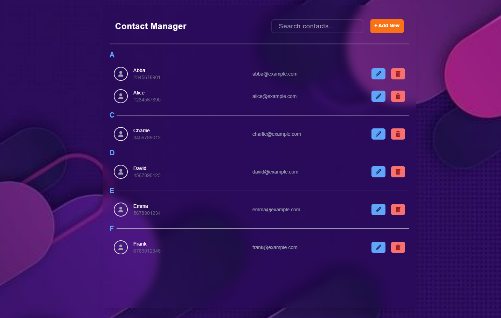
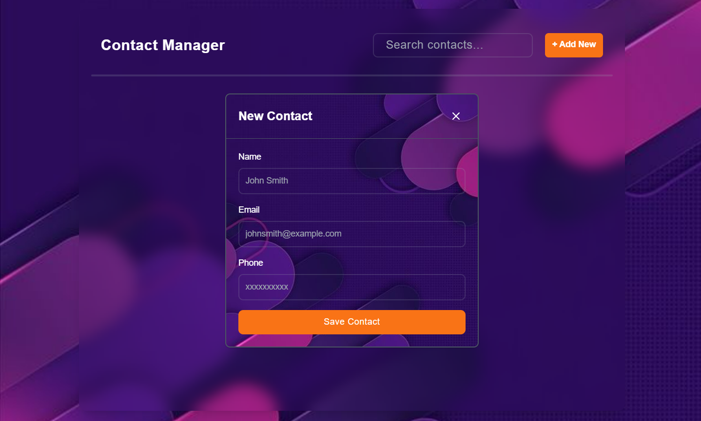
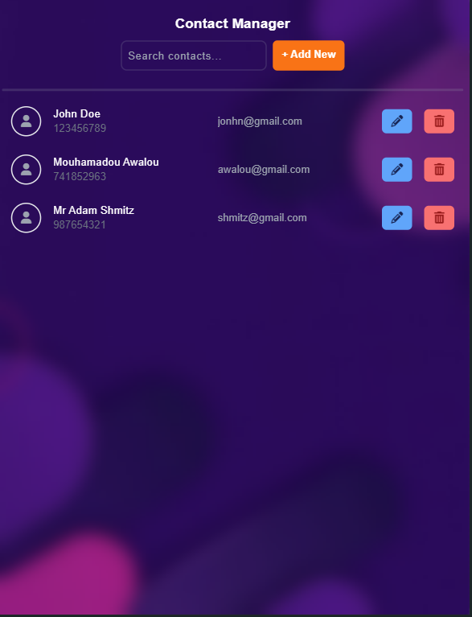

<h1 align='center'><b>💥 CONTACT MANAGER 💥</b></h1>

<!-- -------------------------------------------------------------------------------------------------------------- -->

<h3 align='center'>Tech Stack Used 🎮</h3>
<!-- enlist all the technologies used to create this project from them (Remove comment using 'ctrl+z' or 'command+z') -->

<div align='center'>
  
  
  
  
</div>


<!-- -------------------------------------------------------------------------------------------------------------- -->

## :zap: Description 📃

- This is an contact manager web application which allowed users to view, add, edit, delete and search contact details (name, phone and email).
  
<!-- -------------------------------------------------------------------------------------------------------------- -->

## :zap: How to run it? 🕹️

1. Fork the repository.

2. Clone the project.

```
git clone repository-url
```

3. Install dependencies.

```
npm install
```

4. If you have not installed JSON server in your machine install JSON server using below command.

```
npm install -g json-server
```

5. Start the JSON server

```
npx json-server --watch db.json
```

6. The JSON Server will start a REST API server at `http://localhost:3000/contacts` by default.

7. To run the project, use the Angular CLI command.

```
ng serve
```

8. Open a web browser and go to `http://localhost:4200/` to see the Contact manager running.


<!-- -------------------------------------------------------------------------------------------------------------- -->

## :zap: Screenshots 📸








<!-- -------------------------------------------------------------------------------------------------------------- -->

<h4 align='center'>Developed By <b><i>DHARSHI B.</i></b> 👩</h4>
<p align='center'>
  <a href='https://www.linkedin.com/in/dharshi-balasubramaniyam-47b193243'>
    
  </a>
  <a href='https://github.com/DharshiBalasubramaniyam'>
    
  </a>
</p>

<h4 align='center'>Happy Coding 🧑‍💻</h4>

<h3 align="center">Show some &nbsp;❤️&nbsp; by &nbsp;🌟&nbsp; this repository!</h3>
