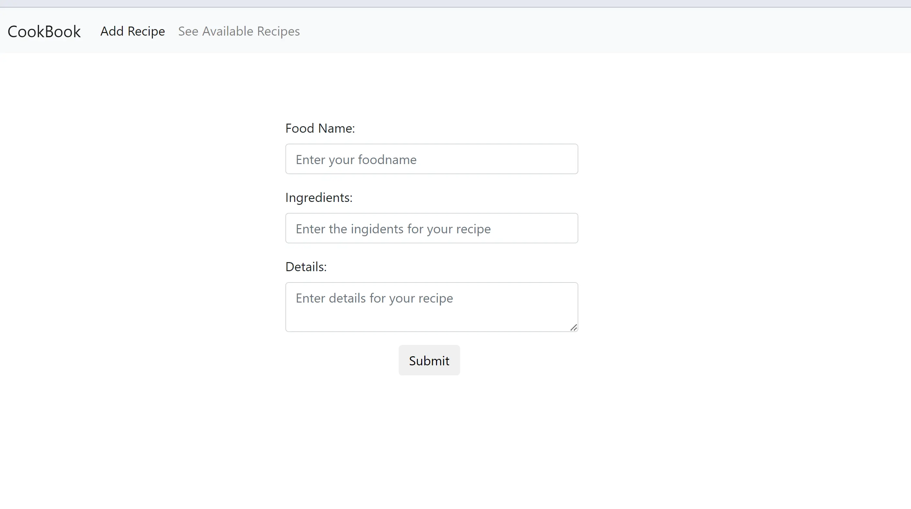

**🍽️ RECIPE SHARING APP 🍽️**
==============================

### Tech Stack Used 🎮

   

* * *

### Description 📃

This is a Recipe Sharing web application that allows users to view, add, edit, delete, and search for delicious recipes (title, ingredients, and instructions).

* * *

### How to run it? 🕹️

1.  Fork the repository.
2.  Clone the project: `git clone repository-url`
3.  Install dependencies: `npm install`
4.  If you have not installed JSON server, install it: `npm install -g json-server`
5.  Start the JSON server: `npx json-server --watch db.json`
6.  The JSON Server will start at `http://localhost:3000/recipes`.
7.  Run the project: `ng serve`
8.  Open your browser at `http://localhost:4200/` to see the app.

* * *

### Screenshots 📸

* * *

#### Developed By **Mehul P** 👩

<h4 align='center'>Developed By <b><i>Mehul Prajapati</i></b> 👦</h4>

  

### Show some  ❤️  by  🌟  this repository!
