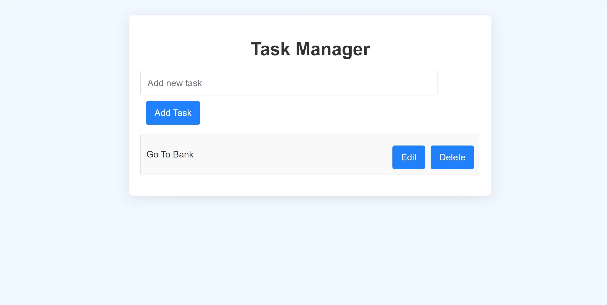

<h1 align='center'><b>📝 Task Manager 📝</b></h1>

<!-- -------------------------------------------------------------------------------------------------------------- -->

<h3 align='center'>Tech Stack Used 🎮</h3>
<!-- enlist all the technologies used to create this project from them (Remove comment using 'ctrl+z' or 'command+z') -->

<!-- -------------------------------------------------------------------------------------------------------------- -->

## :zap: How to run it? 🕹️

- Fork the project and run the `index.html` file directly on any browser.

<!-- -------------------------------------------------------------------------------------------------------------- -->

## :zap: Screenshots 📸
 <!-- Replace with your actual screenshot URL -->

<!-- -------------------------------------------------------------------------------------------------------------- -->

<h4 align='center'>Developed By <b><i>Mehul Prajapati</i></b> 👦</h4>

  

<h4 align='center'>Happy Coding 🧑‍💻</h4>

<h3 align="center">Show some &nbsp;❤️&nbsp; by &nbsp;🌟&nbsp; this repository!</h3>
