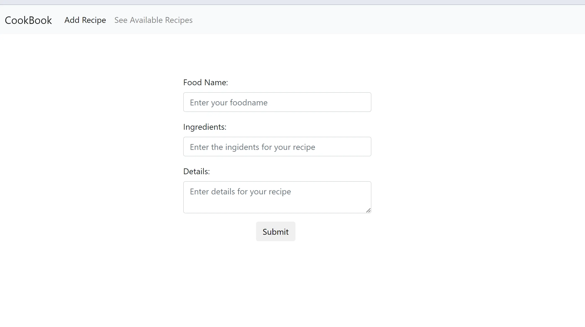

<h1 align='center'><b>💥 RECIPE SHARING APP💥</b></h1>

<!-- -------------------------------------------------------------------------------------------------------------- -->
<h3 align='center'>Tech Stack Used 🎮</h3>
<!-- enlist all the technologies used to create this project from them (Remove comment using 'ctrl+z' or 'command+z') -->

  
  
  
  

## :zap: Description 📃

    

This is a Recipe Sharing web application that allows users to view, add, edit, delete, and search for delicious recipes (title, ingredients, and instructions).

## :zap: How to run it? 🕹️

1.  Fork the repository.
2.  Clone the project: `git clone repository-url`
3.  Install dependencies: `npm install`
4.  Run the project: `ng serve`
5.  Open your browser at `http://localhost:4200/` to see the app.

* * *

## :zap: Screenshots 📸

<!-- -------------------------------------------------------------------------------------------------------------- -->

<h4 align='center'>Developed By <b><i>Mehul Prajapati</i></b> 👦</h4>

  

<h4 align='center'>Happy Coding 🧑‍💻</h4>

<h3 align="center">Show some &nbsp;❤️&nbsp; by &nbsp;🌟&nbsp; this repository!</h3>
