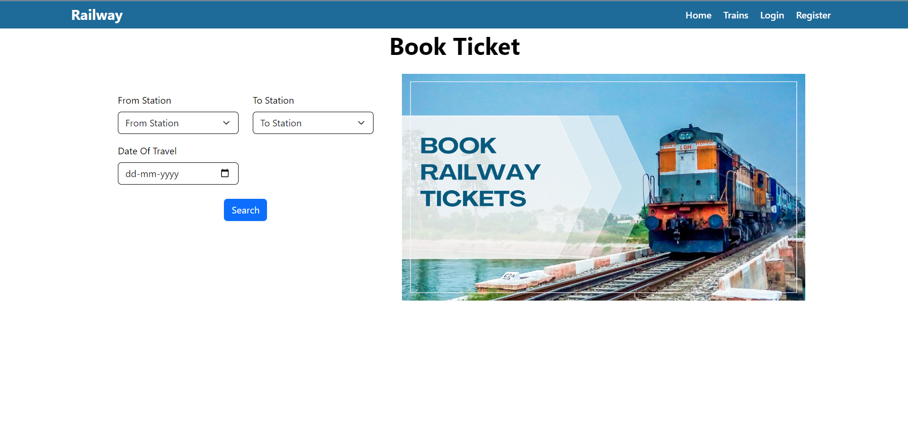

<h1 align='center'><b>💥 Train Booking Website 💥</b></h1>

<!-- -------------------------------------------------------------------------------------------------------------- -->

<h3 align='center'>Tech Stack Used 🎮</h3>
<!-- enlist all the technologies used to create this project from them (Remove comment using 'ctrl+z' or 'command+z') -->

<div align='center'>

  
  
  
  
</div>


<!-- -------------------------------------------------------------------------------------------------------------- -->

## :zap: Description 📃

<div>
    <p>A train booking website using Angular that helps users book train website for their travels</p>
</div>


## :zap: How to run it? 🕹️
First, run the development server:

```bash
npm run dev
# or
yarn dev
# or
pnpm dev
# or
bun dev
```

Open [http://localhost:3000](http://localhost:3000) with your browser to see the result.


## :zap: Screenshots 📸



<!-- -------------------------------------------------------------------------------------------------------------- -->

<h4 align='center'>Developed By <b><i>Pulkit Gupta</i></b> 👦</h4>
<p align='center'>
  <a href='www.linkedin.com/in/pulkitgupta2408'>
    
  </a>
  <a href='https://github.com/pulkit1417'>
    
  </a>
</p>

<h4 align='center'>Happy Coding 🧑‍💻</h4>

<h3 align="center">Show some &nbsp;❤️&nbsp; by &nbsp;🌟&nbsp; this repository!</h3>
