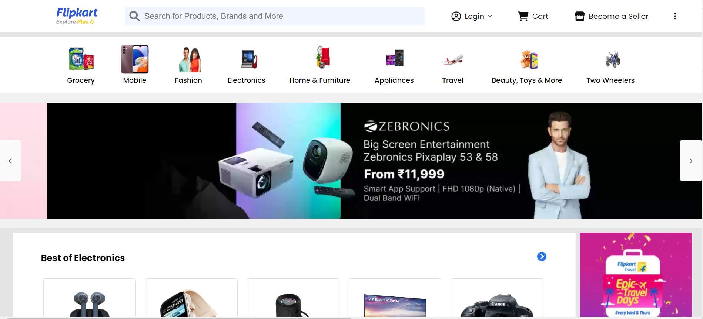

<h1 align='center'><b>Flipkart Clone</b></h1>

<!-- -------------------------------------------------------------------------------------------------------------- -->

<h3 align='center'>Tech Stack Used 🎮</h3>

  
  

<!-- -------------------------------------------------------------------------------------------------------------- -->

## :zap: Description 📃

  
This project is a basic HTML and CSS clone of the Flipkart website, designed to replicate its layout and styling. It focuses on recreating the user interface elements and overall visual design of Flipkart. 

<!-- -------------------------------------------------------------------------------------------------------------- -->

## :zap: How to run it? 🕹️

  
To run this project locally, follow these steps:

1. Fork the repository.

2. Clone the repository to your local machine:
    git clone https://github.com/your-username/Amazon-Prime-Clone.git

3. Open the project folder in your preferred code editor, now you can view website in live.

<!-- -------------------------------------------------------------------------------------------------------------- -->

## :zap: Screenshots 📸
<!-- add the screenshot of the project (Mandatory) -->

<!-- -------------------------------------------------------------------------------------------------------------- -->

<h4 align='center'>Developed By <b><i>Anagha Chaudhari</i></b></h4>

  
  

<h4 align='center'>Happy Coding 🧑‍💻</h4>

<h3 align="center">Show some &nbsp;❤️&nbsp; by &nbsp;🌟&nbsp; this repository!</h3>
