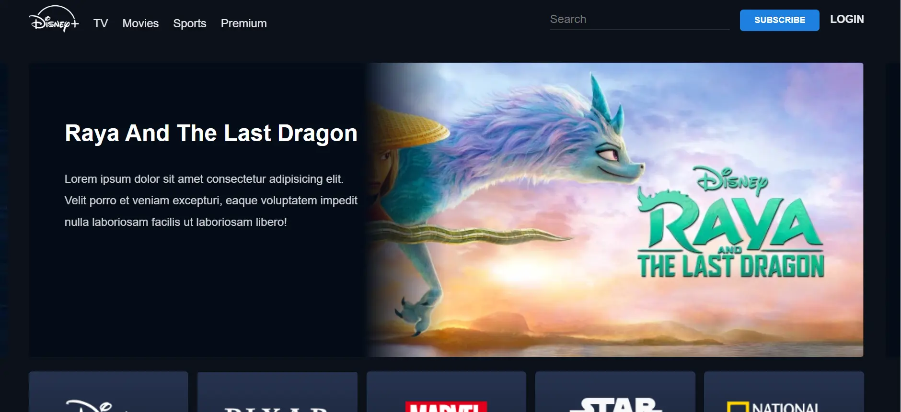

<h1 align='center'><b>💥Hotstar Clone💥</b></h1>

<!-- -------------------------------------------------------------------------------------------------------------- -->

<h3 align='center'>Tech Stack Used 🎮</h3>

  
  
  

<!-- -------------------------------------------------------------------------------------------------------------- -->

## :zap: Description 📃

  <!-- 
Add Description of the project
 -->
    
This project is a simple HTML Js and CSS implementation of a Hotstar website clone. It aims to replicate the basic structure and styling of the popular website Hotstar.

<!-- -------------------------------------------------------------------------------------------------------------- -->

## :zap: How to run it? 🕹️

To run this project locally, follow these steps:

1. Fork the repository.

2. Clone the repository to your local machine:
git clone 

3. Open the project folder in your preferred code editor, now you can view website in live.

<!-- -------------------------------------------------------------------------------------------------------------- -->

## :zap: Screenshots 📸

<!-- -------------------------------------------------------------------------------------------------------------- -->

<h4 align='center'>Developed By <b><i>Aditi Jain</i></b> 👦</h4>

  

<h4 align='center'>Happy Coding 🧑‍💻</h4>

<h3 align="center">Show some &nbsp;❤️&nbsp; by &nbsp;🌟&nbsp; this repository!</h3>
