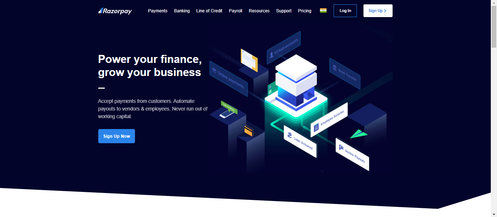

# 💥 RazorPay-Clone 💥

## Tech Stack Used 🎮
- **HTML**
- **TailwindCSS**

---

## ⚡ Description 📃
This project is a clone of the Razorpay website, built to replicate its design and layout using HTML and TailwindCSS. It serves as a practice to enhance web development skills and showcase the implementation of responsive design using modern CSS frameworks.

---

## ⚡ How to run it? 🕹️

1. **Clone the repository**:
    ```bash
    git clone https://github.com/your-username/razorpay-clone.git
    ```
1. **Navigate to the project directory:**:
    ```bash
    cd razorpay-clone
    ```
1. **Open the index.html file in your browser to view the project:**:
    ```bash
    open index.html
    ```

## ⚡ Screenshots 📸



## ⚡ Working Video 📹

<video controls src="bandicam 2024-10-15 14-42-12-192.mp4" title="Working Video"></video>