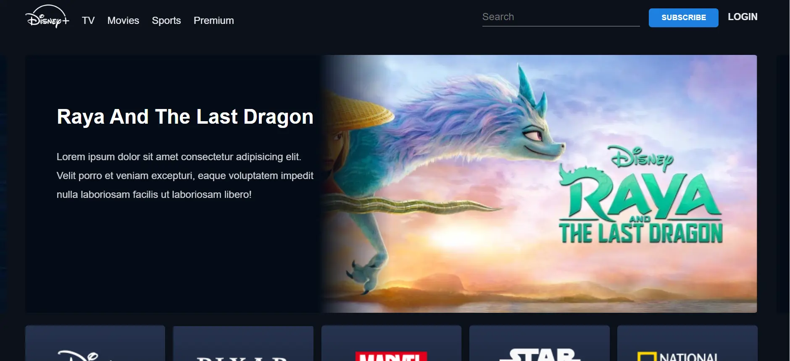

<h2>Hey <𝚌𝚘𝚍𝚎𝚛𝚜/>! 👋</h2>

## :zap: Available Projects 🎉
<!-- ###################################################################################################################### -->
<!-- ###################################################################################################################### -->

#### :zap: Row 1

|  |  |  |
|:--:|:--:|:--:|
| [Animated Tea Cup](./Basic/Animated-Tea-Cup) | [Biography BR Ambedkar](./Basic/Biography-BR-Ambedkar) | [Biography Mahatma Gandhi](./Basic/Biography-Mahatma-Gandhi) |

#### :zap: Row 2

|  |  |  |
|:--:|:--:|:--:|
| [Blood Donation Form](./Basic/Blood-Donation-Form) | [Facebook Login Page](./Basic/Facebook-Login-Page) | [Feedback Form](./Basic/Feedback-Form) |

#### :zap: Row 3

|  |  |  |
|:--:|:--:|:--:|
| [FlexFlow](./Basic/FlexFlow) | [Google Drive Clone](./Basic/Google-Drive-Clone) | [Google Search Clone](./Basic/Google-Search-Clone) |

#### :zap: Row 4

|  |  |  |
|:--:|:--:|:--:|
| [Login Signup Form](./Basic/Login-Signup-Form) | [PhonePe](./Basic/PhonePe) | [SpaceX Website Clone](./Basic/SpaceX-Website-Clone) |

#### :zap: Row 5

|  |  |  |
|:--:|:--:|:--:|
| [Starbucks Landing page](./Basic/Starbucks-Landing-page) | [Survey Form](./Basic/Survey-Form) |  |

---
<!-- ###################################################################################################################### -->
<!-- ###################################################################################################################### -->

#### :zap: Row 1

|  |  |  |
|:--:|:--:|:--:|
| [Amazon Prime Clone](./Intermediate/Amazon-Prime-Clone) | [Apple Clone](./Intermediate/Apple-Clone) | [Book Website](./Intermediate/Book-Website) |

#### :zap: Row 2

|  |  |  |
|:--:|:--:|:--:|
| [Flipkart Clone](./Intermediate/Flipkart-Clone) | [Hotstar Clone](./Intermediate/Hotstar-Clone) | [IPHONE 14 Pro Clone](./Intermediate/IPHONE-14-Pro-Clone) |        

#### :zap: Row 3

|  |  |  |
|:--:|:--:|:--:|
| [Linktree Clone](./Intermediate/Linktree-Clone) | [MakeMyTrip Clone](./Intermediate/MakeMyTrip-Clone) | [Microsoft Clone](./Intermediate/Microsoft-Clone) |

#### :zap: Row 4

|  |  |  |
|:--:|:--:|:--:|
| [Netflix Clone](./Intermediate/Netflix-Clone) | [Product Landing Page](./Intermediate/Product-Landing-Page) | [Reddit Clone](./Intermediate/Reddit-Clone) |

#### :zap: Row 5

|  |  |  |
|:--:|:--:|:--:|
| [Spotify Clone](./Intermediate/Spotify-Clone) |  |  |

---
<!-- ###################################################################################################################### -->
<!-- ###################################################################################################################### -->

#### :zap: Row 1 

|  |  |  |
|:--:|:--:|:--:|
|  |  |  |

	<h3>Show some &nbsp;❤️&nbsp; by &nbsp;🌟&nbsp; this repository!</h3>

