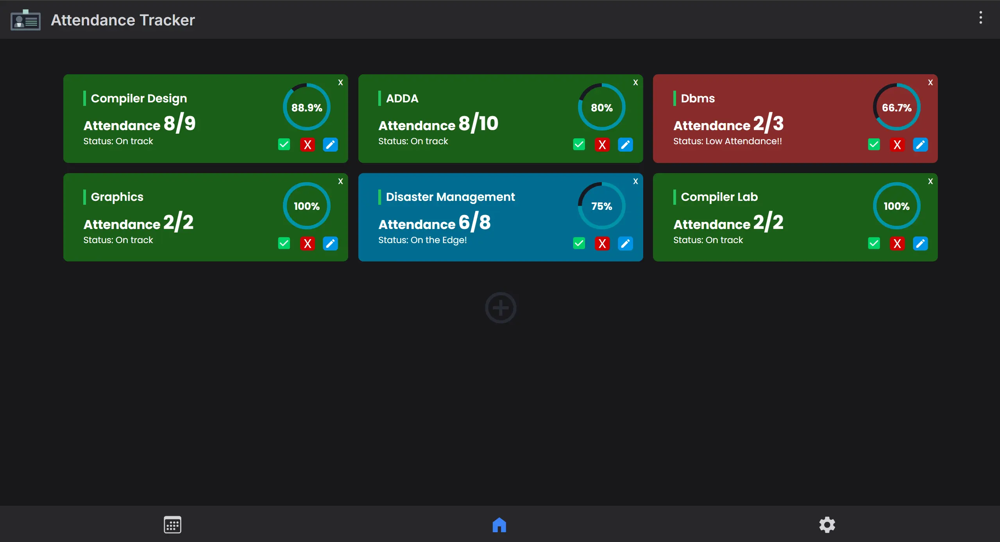

<h1 align='center'><b>💥 Attendance Tracker 💥</b></h1>

<!-- -------------------------------------------------------------------------------------------------------------- -->

<h3 align='center'>Tech Stack Used 🎮</h3>
<!-- enlist all the technologies used to create this project from them (Remove comment using 'ctrl+z' or 'command+z') -->

<div align='center'>


</div>


<!-- -------------------------------------------------------------------------------------------------------------- -->

## :zap: Description 📃

<div>
  <!-- <p>Add Description of the project</p> -->
    <p>
   The attendance tracker is a web application that allows users to keep track of attendance for various events or activities. It is built using a combination of HTML, CSS, and JavaScript for the frontend. The UI is designed using Tailwind CSS, which provides a responsive and modern look to the application. React and Next.js are used for building the frontend components and managing the application's state. Firebase is used as the backend service for storing and retrieving attendance data.

Feel free to explore the screenshots section to get a visual representation of the application. If you have any questions or need further assistance, please don't hesitate to reach out.

</p>
</div>
</div>

<!-- -------------------------------------------------------------------------------------------------------------- -->

## :zap: How to run it? 🕹️

<!-- Add steps how to run this project -->

Steps to run this website in your local machine is as follows :

1. Fork this repository.
2. Clone the repository to your local machine.
3. Open a terminal and navigate to the project directory.
4. Create a .env file & fill the following .env template with your firebase credentials

```
NEXT_PUBLIC_FIREBASE_API_KEY=your_api_key
NEXT_PUBLIC_FIREBASE_AUTH_DOMAIN=your_auth_domain
NEXT_PUBLIC_FIREBASE_PROJECT_ID=your_project_id
NEXT_PUBLIC_FIREBASE_STORAGE_BUCKET=your_storage_bucket
NEXT_PUBLIC_FIREBASE_MESSAGING_SENDER_ID=your_messaging_sender_id
NEXT_PUBLIC_FIREBASE_APP_ID=your_app_id
```

5. Run the command `npm install` to install the required dependencies.
6. Run the command `npm run dev` to start the development server.
7. Open a web browser and visit `localhost:3000` to access the application.
8. Make sure you have Node.js installed on your machine before running the above commands.

<!-- -------------------------------------------------------------------------------------------------------------- -->

## :zap: Screenshots 📸

<!-- add the screenshot of the project (Mandatory) -->




<!-- -------------------------------------------------------------------------------------------------------------- -->

<h4 align='center'>Developed By <b><i>Anirudh Sharma</i></b> 👦</h4>
<p align='center'>
  <a href='https://www.linkedin.com/in/anirudh-sharma-58ba29256/'>
    
  </a>
  <a href='https://github.com/anisharma07'>
    
  </a>
</p>

<h4 align='center'>Happy Coding 🧑‍💻</h4>

<h3 align="center">Show some &nbsp;❤️&nbsp; by &nbsp;🌟&nbsp; this repository!</h3>
