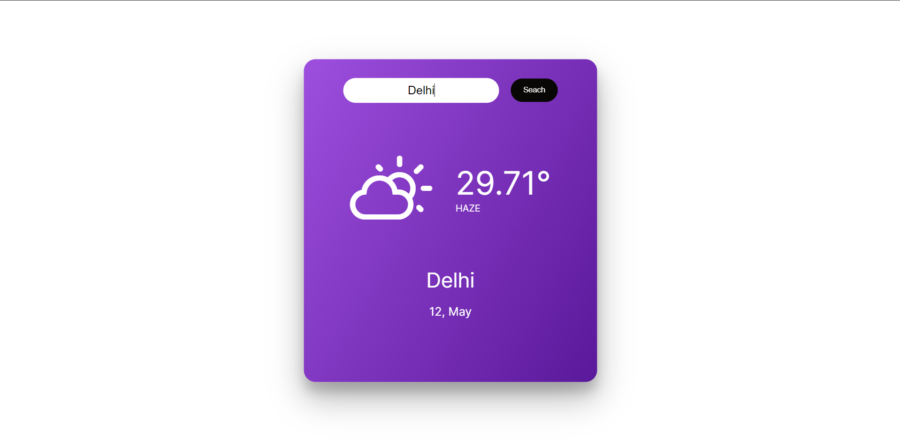
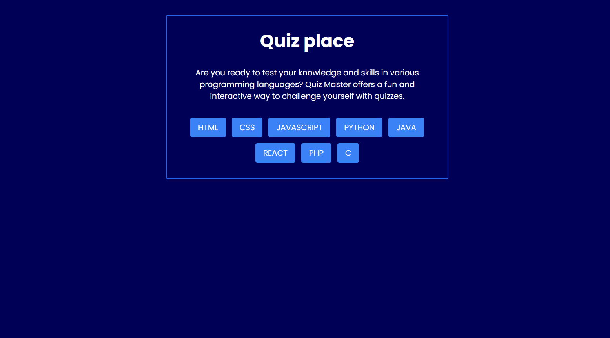
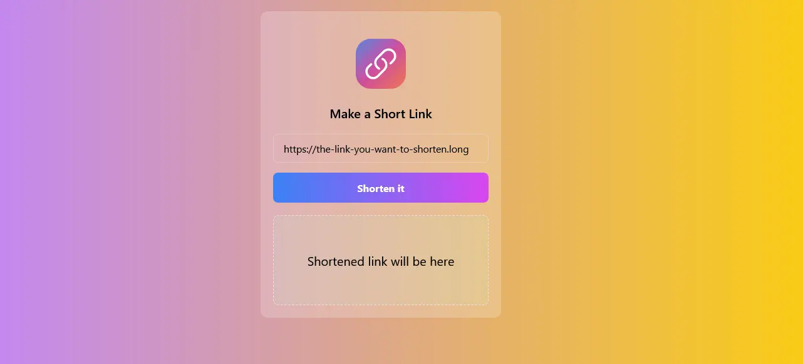
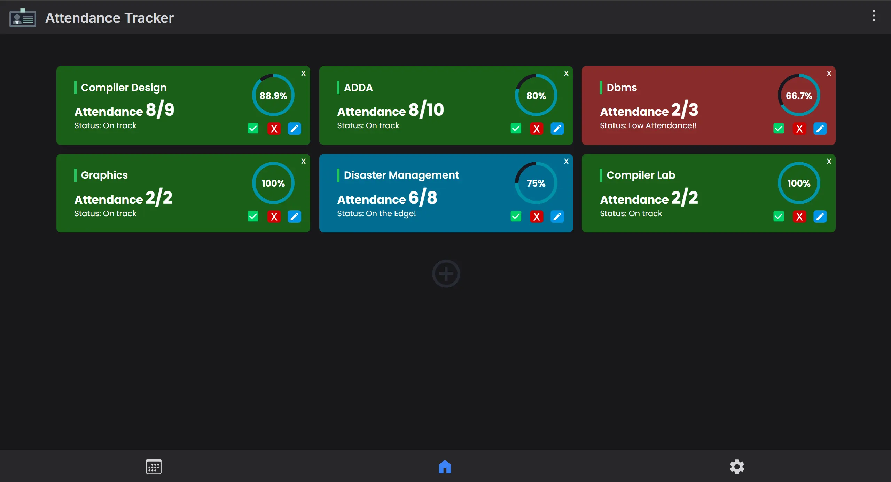
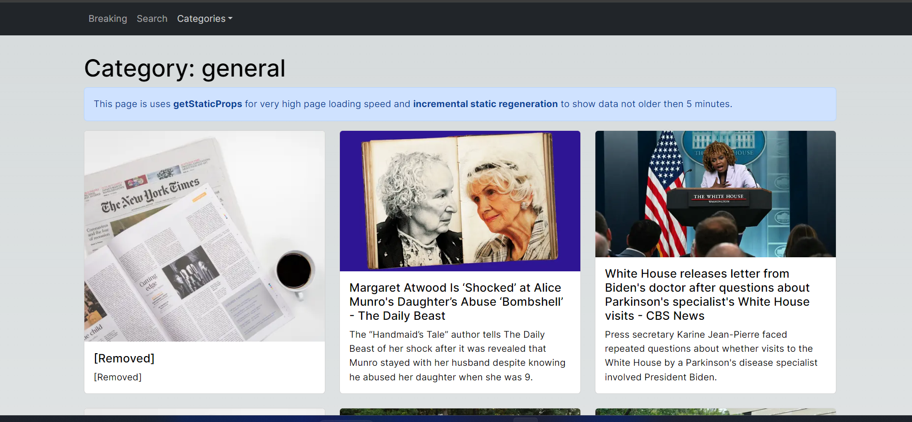

<h2>Hey <𝚌𝚘𝚍𝚎𝚛𝚜/>! 👋</h2>

## :zap: Available Projects 🎉
<!-- ###################################################################################################################### -->
<!-- ###################################################################################################################### -->

#### :zap: Row 1

|  |  |  |
|:--:|:--:|:--:|
| [Weather Website](./Basic/Weather-Website) |  |  |

---
<!-- ###################################################################################################################### -->
<!-- ###################################################################################################################### -->

#### :zap: Row 1

|  |  |  |
|:--:|:--:|:--:|
| [Quiz App](./Intermediate/Quiz-App) | [Url Shortener](./Intermediate/Url-Shortener) |  |

---
<!-- ###################################################################################################################### -->
<!-- ###################################################################################################################### -->

#### :zap: Row 1

|  |  |  |
|:--:|:--:|:--:|
| [Attendance Tracking App](./Advanced/Attendance-Tracking-App) | [Breaking News App](./Advanced/Breaking-News-App) |  |

	<h3>Show some &nbsp;❤️&nbsp; by &nbsp;🌟&nbsp; this repository!</h3>

