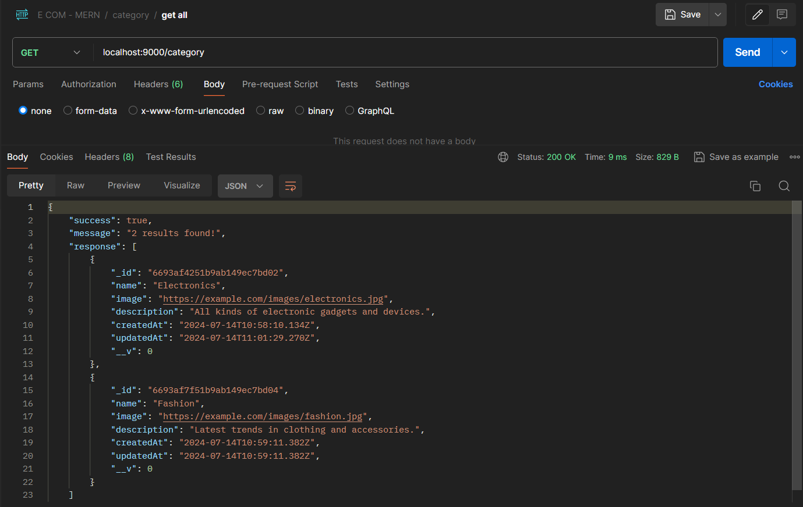

<h1 align='center'><b>💥 E COMMERCE APPLICATION 💥</b></h1>

<!-- -------------------------------------------------------------------------------------------------------------- -->

<h3 align='center'>Tech Stack Used 🎮</h3>
<!-- enlist all the technologies used to create this project from them (Remove comment using 'ctrl+z' or 'command+z') -->

<div align='center'>
  
  
  
</div>


<!-- -------------------------------------------------------------------------------------------------------------- -->

## :zap: Description 📃

- Backend infrastructure for an e commerce application.
  
<!-- -------------------------------------------------------------------------------------------------------------- -->

## :zap: How to run it? 🕹️

1. Fork the repository.

2. Clone the project.

```
git clone repository-url
```

3. Install dependencies.

```
npm install
```

4. Create and update `.env` file.

```
PORT=YOUR_PORT
MONGODB_URL=YOUR_MONGODB_URL
JWT_SECRET_KEY=YOUR_JWT_SECRET_KEY
JWT_REFRESH_SECRET_KEY=YOUR_REFRESH_SECRET_KEY
EMAIL=YOUR_EMAIL
EMAIL_PASSWORD=YOUR_EMAIL_PASSWORD
```

5. Run the server.

```
npm start
```

6. Check the endpoints via postman/frontend.


<!-- -------------------------------------------------------------------------------------------------------------- -->

## :zap: Screenshots 📸

### REGISTER (Authentication: No)


### RESEND OTP (Authentication: No)


### VERIFY OTP (Authentication: No)


### LOGIN (Authentication: No)


### REFRESH TOKEN (Authentication: No)


### CREATE CATEGORY (Authentication: ADMIN)


### UPDATE CATEGORY (Authentication: ADMIN)


### DELETE CATEGORY (Authentication: ADMIN)


### GET ALL CATEGORY (Authentication: No)


### GET CATEGORY BY ID (Authentication: No)


### CREATE PRODUCT (Authentication: ADMIN)


### UPDATE PRODUCT (Authentication: ADMIN)


### DELETE PRODUCT (Authentication: ADMIN)


### FILTER PRODUCTS (Authentication: No)


### GET PRODUCT BY ID (Authentication: No)


### ADD ITEM TO WISHLIST (Authentication: USER)


### REMOVE ITEM FROM WISHLIST (Authentication: USER)


### GET WISHLIST BY USER (Authentication: USER)


### ADD ITEM TO CART (Authentication: USER)


### UPDATE QUANTITY OF ITEM IN CART (Authentication: USER)


### REMOVE ITEM FROM CART (Authentication: USER)


### CLEAR CART (Authentication: USER)


### GET CART BY USER (Authentication: USER)


### CREATE ORDER (Authentication: USER)


### UPDATE ORDER STATUS (Authentication: ADMIN)


### GET ALL ORDER (Authentication: ADMIN)


### GET ORDER BY USER (Authentication: ADMIN, USER)


### GET ORDER BY STATUS (Authentication: ADMIN, USER)


### GET ORDER BY ID (Authentication: ADMIN, USER)


<!-- -------------------------------------------------------------------------------------------------------------- -->

<h4 align='center'>Developed By <b><i>DHARSHI B.</i></b> 👩</h4>
<p align='center'>
  <a href='https://www.linkedin.com/in/dharshi-balasubramaniyam-47b193243'>
    
  </a>
  <a href='https://github.com/DharshiBalasubramaniyam'>
    
  </a>
</p>

<h4 align='center'>Happy Coding 🧑‍💻</h4>

<h3 align="center">Show some &nbsp;❤️&nbsp; by &nbsp;🌟&nbsp; this repository!</h3>
