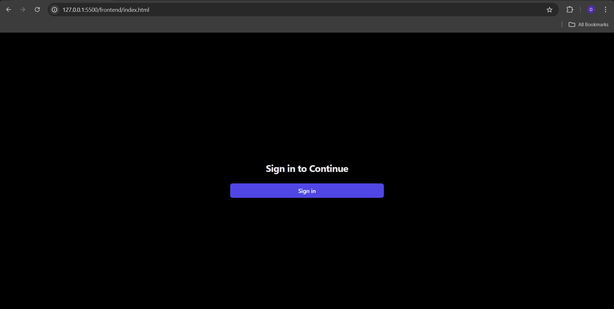
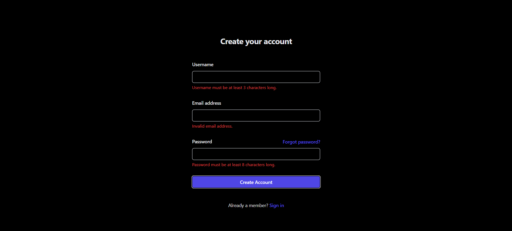
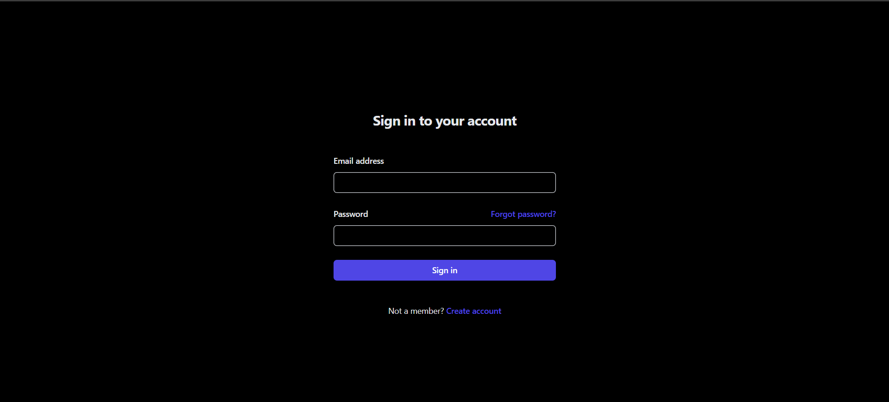
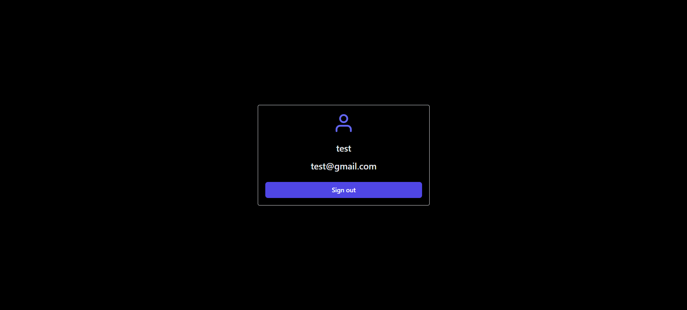

<h1 align='center'><b>💥 USER REGISTRATION SYSTEM 💥</b></h1>

<!-- -------------------------------------------------------------------------------------------------------------- -->

<h3 align='center'>Tech Stack Used 🎮</h3>
<!-- enlist all the technologies used to create this project from them (Remove comment using 'ctrl+z' or 'command+z') -->

<div align='center'>


</div>


<!-- -------------------------------------------------------------------------------------------------------------- -->

## :zap: Description 📃

- This is a website which takes users details and create account
- After creating account, users can login and see their profile information.
  
<!-- -------------------------------------------------------------------------------------------------------------- -->

## :zap: How to run it? 🕹️

1. Fork the repository.

2. Clone the project.

```
git clone repository-url
```

3. Navigate to `backend` folder.

```
cd ./backend
```

4. Install dependencies.

```
npm install
```

5. Create and update `.env` file.

```
PORT=YOUR_PORT
MONGODB_URL=YOUR_MONGODB_URI
JWT_SECRET_KEY=YOUR_SECRET_KEY
```

6. Start server.

```
npm start
```

6. Navigate to `frontend` folder and open `index.html` on browser to view the website.


<!-- -------------------------------------------------------------------------------------------------------------- -->

## :zap: Screenshots 📸







<!-- -------------------------------------------------------------------------------------------------------------- -->

<h4 align='center'>Developed By <b><i>DHARSHI B.</i></b> 👩</h4>
<p align='center'>
  <a href='https://www.linkedin.com/in/dharshi-balasubramaniyam-47b193243'>
    
  </a>
  <a href='https://github.com/DharshiBalasubramaniyam'>
    
  </a>
</p>

<h4 align='center'>Happy Coding 🧑‍💻</h4>

<h3 align="center">Show some &nbsp;❤️&nbsp; by &nbsp;🌟&nbsp; this repository!</h3>
