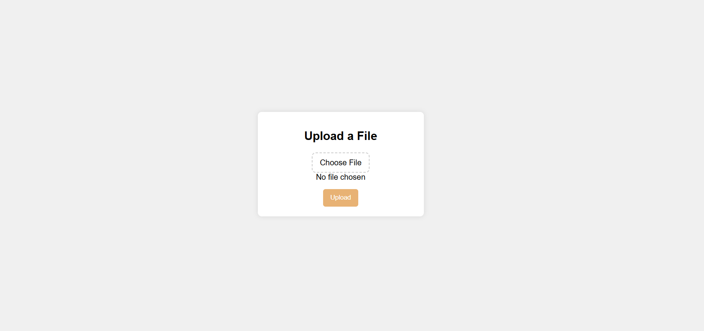

<h1 align='center'><b>💥 File Upload and Download System 💥</b></h1>
<h3 align='center'>Tech Stack Used 🎮</h3>
<div align="center">
   
   
   
   
   
</div>

## :zap: Description 📃
<div>
    <p>
      Easily manage your files with our File Upload and Download System. Built using HTML, CSS, JavaScript, Node.js, and Express.js, this application provides a simple and user-friendly interface for uploading files and downloading them from any device, anywhere.
    </p>
</div>
## :zap: How to run it? 🕹️
-   Clone the repository into your local machine
    ```
      git clone https://github.com/Avdhesh-Varshney/WebMasterLog.git
    ```
-   Go to the `File-Upload-Download-System` directory
-   Install Dependencies
    ```
      npm install
    ```
-   Run the server
    ```
      npm run dev
    ```
-   Open your browser and visit `http://localhost:3000`
## :zap: Screenshots 📸


<h4 align='center'>Developed By <b><i>Aashutosh Singh</i></b> 👦</h4>
<p align='center'>
  <a href='https://www.linkedin.com/in/aashutosh148/'>
    
  </a>
  <a href='https://github.com/aashutosh148'>
    
  </a>
</p>
<h4 align='center'>Happy Coding 👦</h4>
<h3 align="center">Show some &nbsp;❤️&nbsp; by &nbsp;🌟&nbsp; this repository!</h3>
