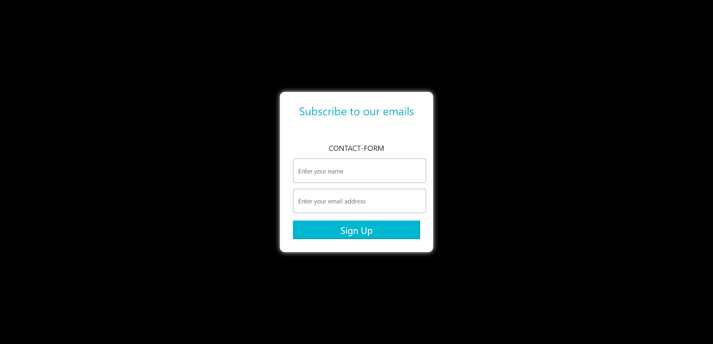

<h1 align='center'><b>💥 GMAIL NODEMAILER 💥</b></h1>

<!-- -------------------------------------------------------------------------------------------------------------- -->

<h3 align='center'>Tech Stack Used 🎮</h3>
<!-- enlist all the technologies used to create this project from them (Remove co
mment using 'ctrl+z' or 'command+z') -->

  
  

  

  

  

<!-- -------------------------------------------------------------------------------------------------------------- -->

## :zap: Description 📃

  <h3>GMAIL NODEMAILER</h3>
  

  <UL>
    <li>This project is a Gmail Nodemailer project that allows users to send emails using Node.js and Gmail API. 
    <li>It utilizes Nodemailer library to send emails and Gmail API for authentication and authorization.
    <li>Users can easily configure their Gmail account credentials and send emails programmatically.
    </li>
    </li>
    </li>
    </ul>

<!-- -------------------------------------------------------------------------------------------------------------- -->

## :zap: How to run it? 🕹️

To run the application follow these steps:

**Step 1:** Fork the repository. Follow these guidelines to know all about how to fork a repository
[Forking a Repo](https://help.github.com/en/github/getting-started-with-github/fork-a-repo)

**Step 2:** Clone the repository. [Cloning a Repo](https://help.github.com/en/desktop/contributing-to-projects/creating-an-issue-or-pull-request)

**Step 3:** Go to Gmail-Nodemailer folder and run

`npm install`

`npm run start`

**Step 4:** Go to `http://localhost:8001` and enter url of the webpage you want to access contents of

## Voila! Have fun using the site.

<!-- -------------------------------------------------------------------------------------------------------------- -->

## :zap: Screenshots 📸

- Web page user interface
 

 

<!-- -------------------------------------------------------------------------------------------------------------- -->

<h4 align='center'>Developed By <b><i>Dhairya gothi</i></b> 👦</h4>

  
  

<h4 align='center'>Happy Coding 🧑‍💻</h4>

<h3 align="center">Show some &nbsp;❤️&nbsp; by &nbsp;🌟&nbsp; this repository!</h3>
