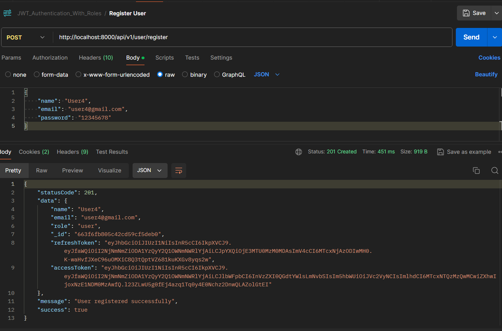
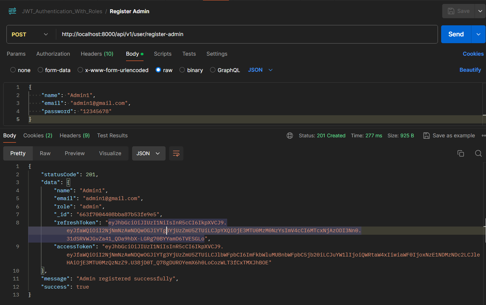
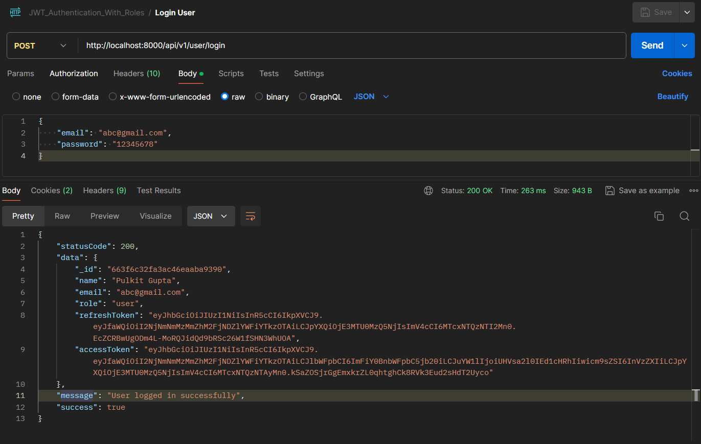
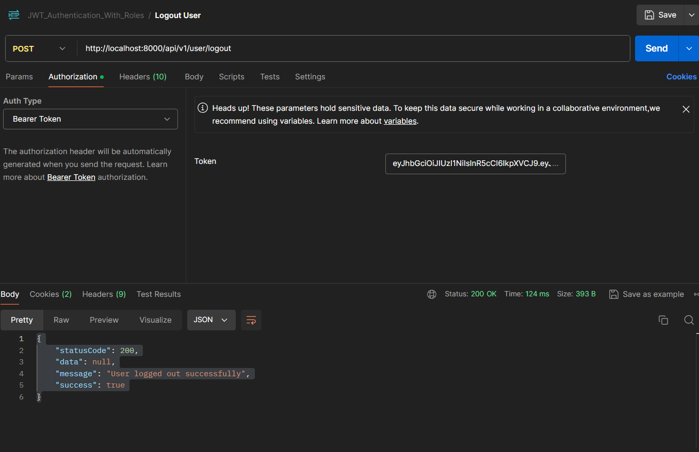
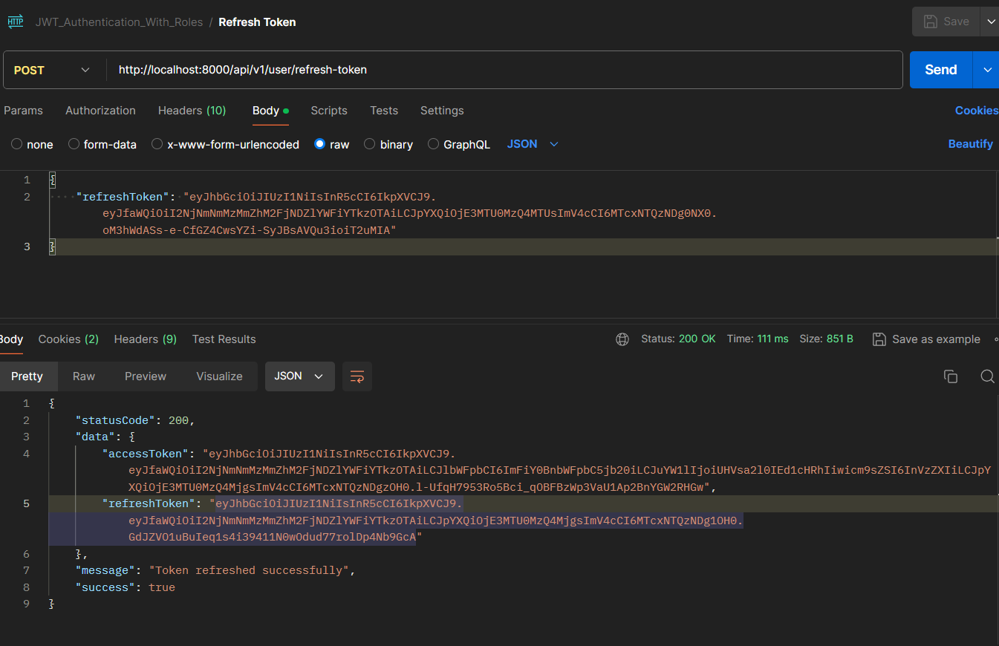
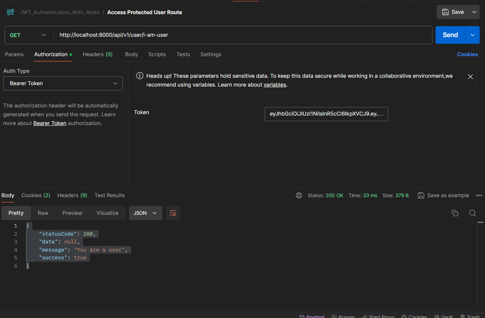
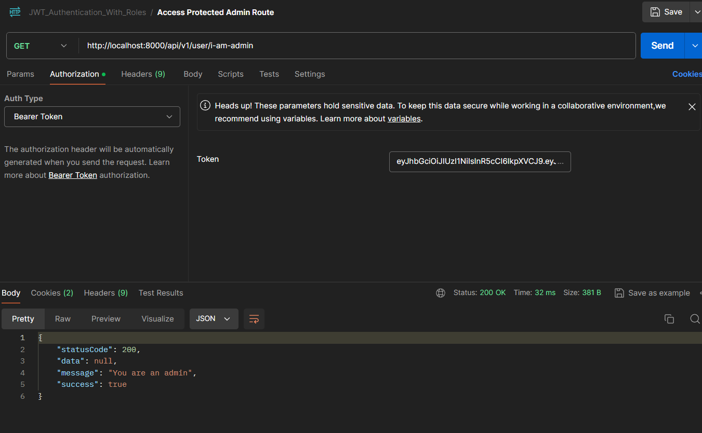

<h1 align='center'><b>💥 JWT-Authenticator-With-Roles 💥</b></h1>

  

  

  

  

##  Description 📃

  
This api helps user to get a modern starting project for production use. This is a standard setup for any production level project. The different files are used to handle different functions. You can clone it to get started on your project quickly.

  This readme file provides all the details you need to run and use this project.

## How to run it? 🕹️

- Clone the repository
- Run `npm install`
- Create a `.env` file and add the following variables
  - `PORT`
  - `ACCESS_TOKEN_SECRET`
  - `REFRESH_TOKEN_SECRET`
  - `ACCESS_TOKEN_EXPIRY`
  - `REFRESH_TOKEN_EXPIRY`
  - `BCRYPT_SALT`
  - `MONGODB_URI`
  - `CORS_ORIGIN`
- Run `npm run dev` or `npm start`

## Features

- **User Authentication**

  - Register
  - Login
  - Logout
  - Refresh Token

- **User Roles**
  - Admin
  - User

## Screenshots of Endpoints

**POST `api/v1/user/register`**

  

**POST `api/v1/user/register-admin`**

  

**POST `api/v1/user/login`**

  

**POST `api/v1/user/logout`**

  

**POST `api/v1/user/refresh-token`**

  

**GET `api/v1/user/i-am-user`**

  

**GET `api/v1/user/i-am-admin`**

  

<h4 align='center'>Developed By <b><i>PULKIT GUPTA</i></b> 👦</h4>

  
  

<h4 align='center'>Happy Coding 🧑‍💻</h4>

<h3 align="center">Show some &nbsp;❤️&nbsp; by &nbsp;🌟&nbsp; this repository!</h3>
