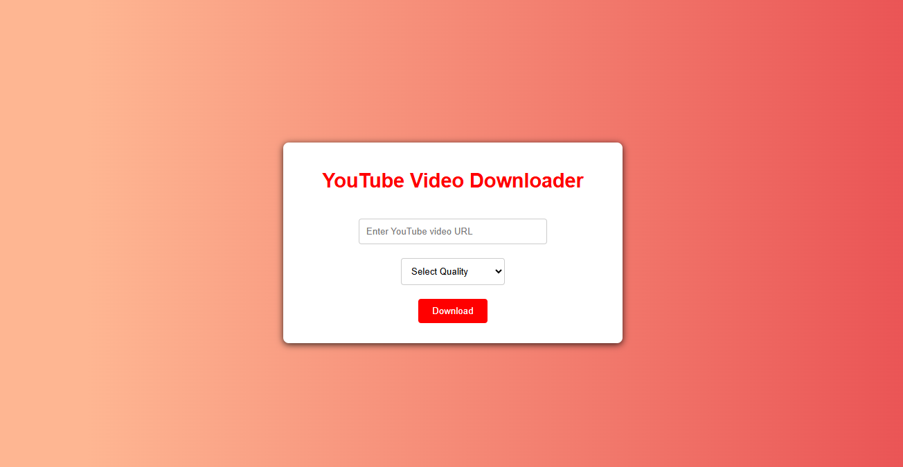

<h1 align='center'><b>💥 Youtube Video Downloader 💥</b></h1>

<!-- -------------------------------------------------------------------------------------------------------------- -->

<h3 align='center'>Tech Stack Used 🎮</h3>
<!-- enlist all the technologies used to create this project from them (Remove comment using 'ctrl+z' or 'command+z') -->
<div align="center">
   
   
   
   
   
</div>


<!-- -------------------------------------------------------------------------------------------------------------- -->

## :zap: Description 📃

<div>
  <!-- <p>Add Description of the project</p> -->
    <p>
      Download your favorite YouTube videos effortlessly with our YouTube Video Downloader. Built using HTML, CSS, JavaScript, and Node.js, this tool provides a simple and user-friendly interface for quick and easy video downloads.
    </p>
</div>


<!-- -------------------------------------------------------------------------------------------------------------- -->

## :zap: How to run it? 🕹️

<!-- Add steps how to run this project -->
- Clone the repository into your local machine
  ```
    git clone https://github.com/Avdhesh-Varshney/WebMasterLog.git
  ```
- Go to the `Youtube-Video-Downloader` directory
- Go to the `server` folder and install Dependencies
  ```
    npm install
  ```
- Run the server
  ```
    nodemon server.js 
  ```
- Go to the `client` folder and run `index.html`

<!-- -------------------------------------------------------------------------------------------------------------- -->

## :zap: Screenshots 📸
<!-- add the screenshot of the project (Mandatory) -->



<!--## :zap: Working Video 📹-->
<!-- directly add the link of video (If, possible) -->


<!-- -------------------------------------------------------------------------------------------------------------- -->

<h4 align='center'>Developed By <b><i>Siddheya Kulkarni</i></b> 👦</h4>
<p align='center'>
  <a href='https://www.linkedin.com/in/siddheya-kulkarni/'>
    
  </a>
  <a href='https://github.com/Asymtode712'>
    
  </a>
</p>

<h4 align='center'>Happy Coding 👦</h4>

<h3 align="center">Show some &nbsp;❤️&nbsp; by &nbsp;🌟&nbsp; this repository!</h3>
