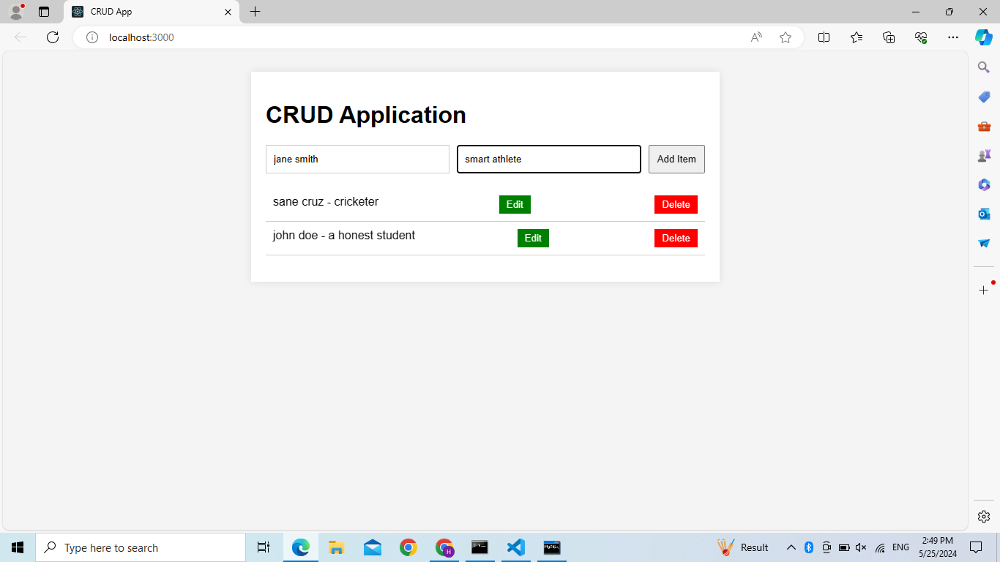
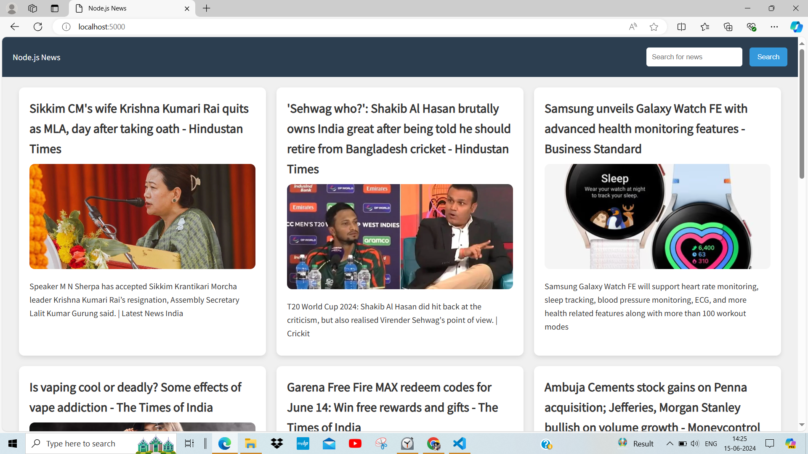
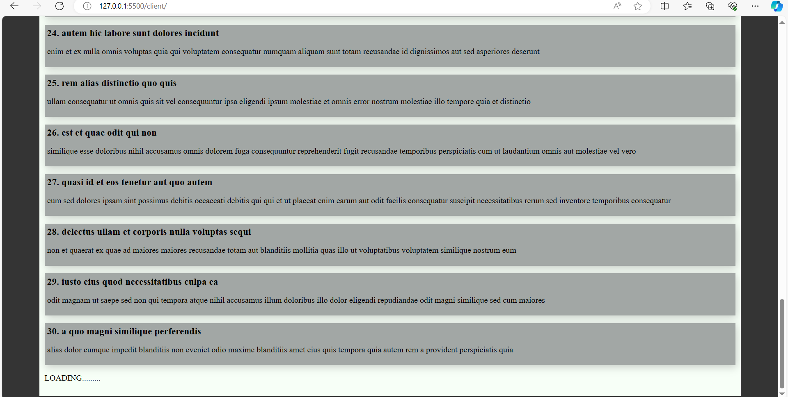
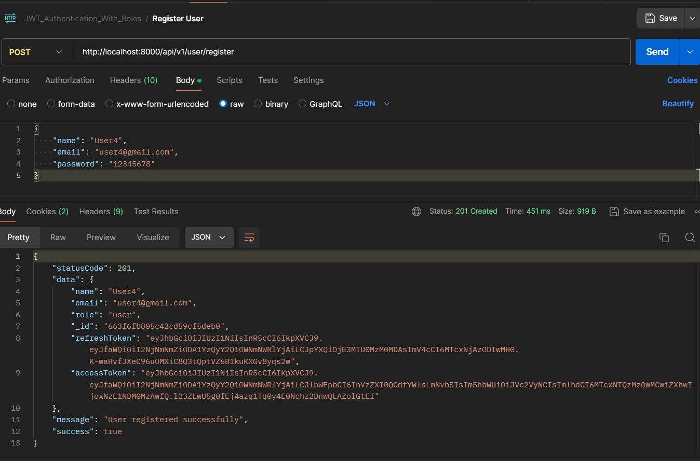
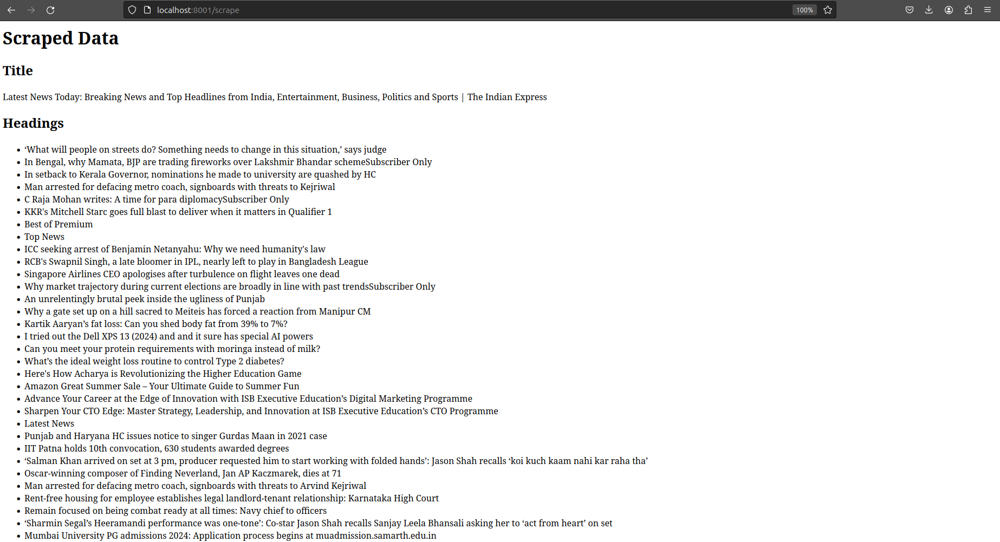
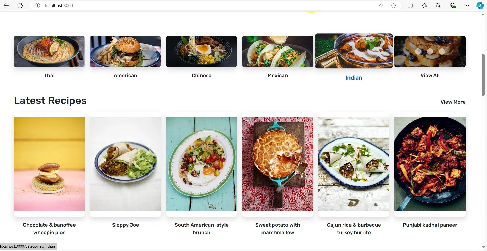
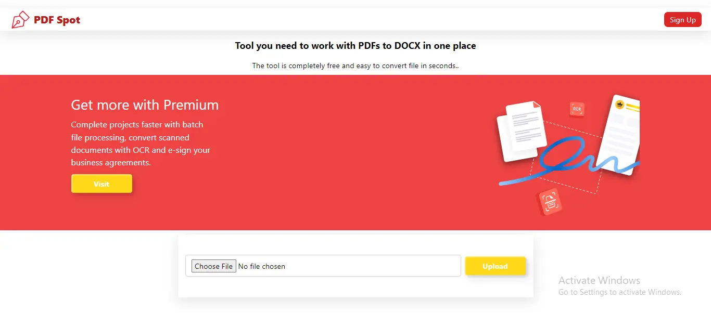
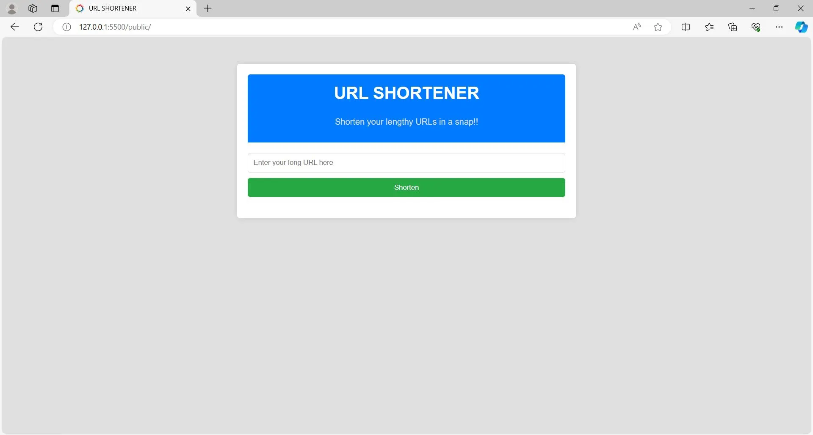
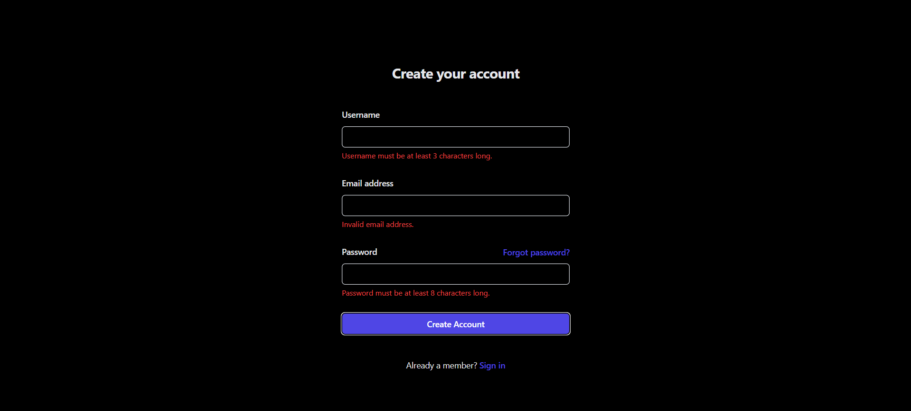

<h2>Hey <𝚌𝚘𝚍𝚎𝚛𝚜/>! 👋</h2>

## :zap: Available Projects 🎉
<!-- ###################################################################################################################### -->
<!-- ###################################################################################################################### -->

#### :zap: Row 1

|  |  |  |
|:--:|:--:|:--:|
| [Crud Operations](./Basic/Crud-Operations) | [Headline Hub](./Basic/Headline-Hub) | [Infinite Scrolling](./Basic/Infinite-Scrolling) |

---
<!-- ###################################################################################################################### -->
<!-- ###################################################################################################################### -->

#### :zap: Row 1

|  |  |  |
|:--:|:--:|:--:|
| [Gmail Nodemailer](./Intermediate/Gmail-Nodemailer) | [JWT Authenticator With Roles](./Intermediate/JWT-Authenticator-With-Roles) | [Url Scraper](./Intermediate/Url-Scraper) |

#### :zap: Row 2

|  |  |  |
|:--:|:--:|:--:|
| [YouTube Video Downloader](./Intermediate/YouTube-Video-Downloader) |  |  |

---
<!-- ###################################################################################################################### -->
<!-- ###################################################################################################################### -->

#### :zap: Row 1

|  |  |  |
|:--:|:--:|:--:|
| [Blog Platform](./Advanced/Blog-Platform) | [Cooking Blog](./Advanced/Cooking-Blog) | [Docx To Pdf Converter](./Advanced/Docx-To-Pdf-Converter) |

#### :zap: Row 2

|  |  |  |
|:--:|:--:|:--:|
| [E Commerce](./Advanced/E-Commerce) | [Url Shortener](./Advanced/Url-Shortener) | [User Registration System](./Advanced/User-Registration-System) |

	<h3>Show some &nbsp;❤️&nbsp; by &nbsp;🌟&nbsp; this repository!</h3>

