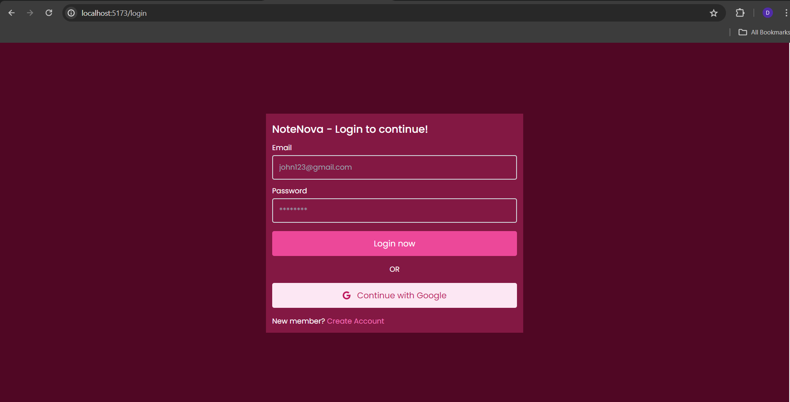
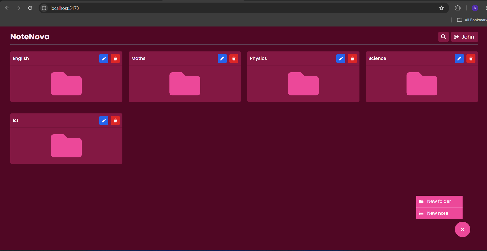
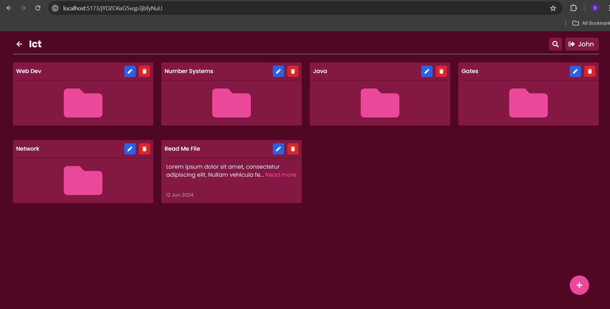
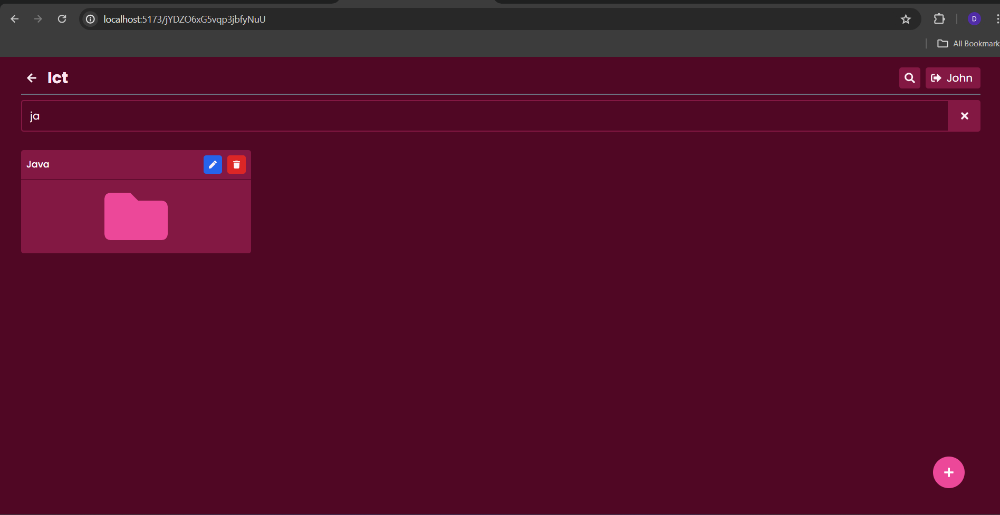
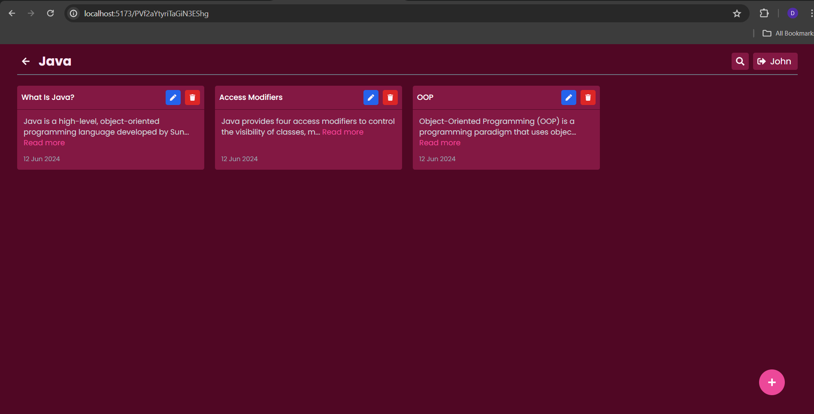
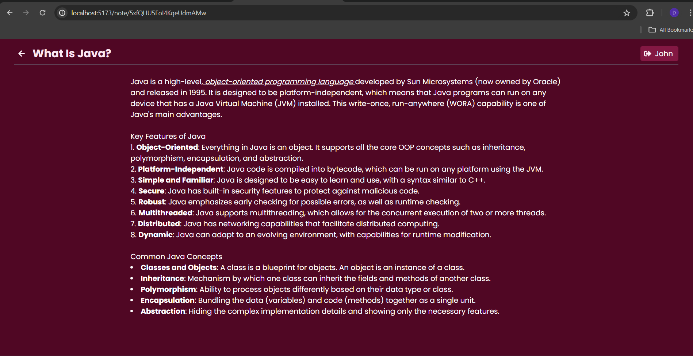
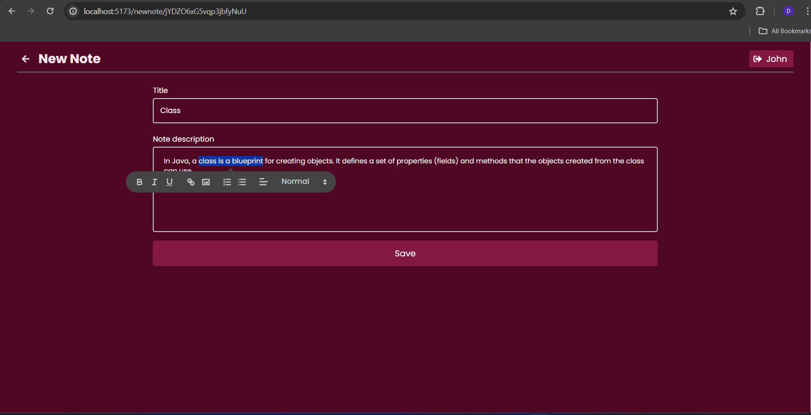
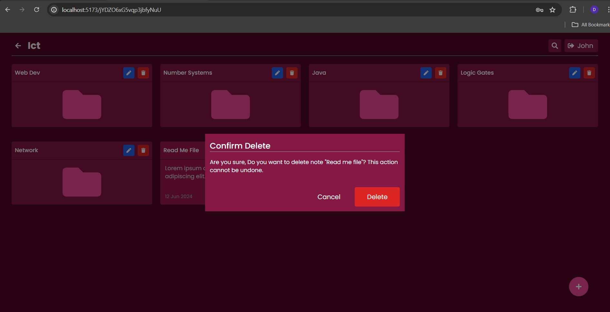
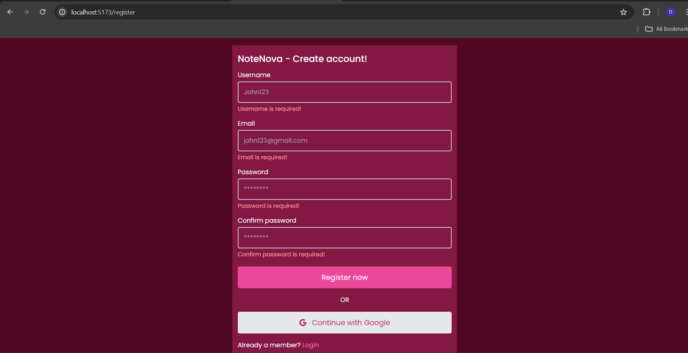

<h1 align='center'><b>💥 NOTES-APP 💥</b></h1>

<!-- -------------------------------------------------------------------------------------------------------------- -->

<h3 align='center'>Tech Stack Used 🎮</h3>
<!-- enlist all the technologies used to create this project from them (Remove comment using 'ctrl+z' or 'command+z') -->

  <!--  -->
  <!--  -->
  <!--  -->
  <!--  -->
  <!--  -->
   
  <!--  -->
   
  <!--  -->
  <!--  -->
  <!--  -->
  <!--  -->
  <!--  -->
  <!--  -->
  <!--  -->

<!-- -------------------------------------------------------------------------------------------------------------- -->

## :zap: Description 📃

  <!-- 
Add Description of the project
 -->
    

      Access the live version of the app at <a href="https://notes-app-a3759.web.app/">here</a>.
      
- Authentication: Login and register using either email/password or Google account.

- Folder Management: Create, edit, delete, and view folders to categorize and store notes.

- Nested Folders: Create nested folders/subfolders, enabling hierarchical organization.

- Note Management: Create, edit, delete, and view notes.

- Text Formatting: Create text with bold, italic, underline, lists, images, and hyperlinks.

- Search Functionality: Easily find notes and folders.

- Responsive Design: Optimized for all screen sizes.
    

<!-- -------------------------------------------------------------------------------------------------------------- -->

## :zap: How to run it? 🕹️

<!-- Add steps how to run this project -->
To run this project locally, follow these steps:

1. Fork the repository.
2. Clone the Repository. git clone repository-url
3. go to root of project directory. cd repository-directory
4. Install Dependencies: npm install
5. setting up firebase - create .env file and fill the required credentials as below.
<code>VITE_FIREBASE_API_KEY=your_api_key</code>
<code>VITE_FIREBASE_AUTH_DOMAIN=your_auth_domain</code>
<code>VITE_FIREBASE_PROJECT_ID=your_project_id</code>
<code>VITE_FIREBASE_STORAGE_BUCKET=your_storage_bucket</code>
<code>VITE_FIREBASE_MESSAGING_SENDER_ID=your_messaging_sender_id</code>
<code>VITE_FIREBASE_APP_ID=your_app_id</code>

6. Run the Development Server. <code>npm run dev</code>
   

<!-- -------------------------------------------------------------------------------------------------------------- -->

## :zap: Screenshots 📸
<!-- add the screenshot of the project (Mandatory) -->
 
 
 
 
 
 
 
 
 
 

## :zap: Working Video 📹
<!-- directly add the link of video (If, possible) -->

<!-- -------------------------------------------------------------------------------------------------------------- -->

<h4 align='center'>Developed By <b><i>YOUR NAME</i></b> 👦</h4>

  
  

<h4 align='center'>Happy Coding 🧑‍💻</h4>

<h3 align="center">Show some &nbsp;❤️&nbsp; by &nbsp;🌟&nbsp; this repository!</h3>

