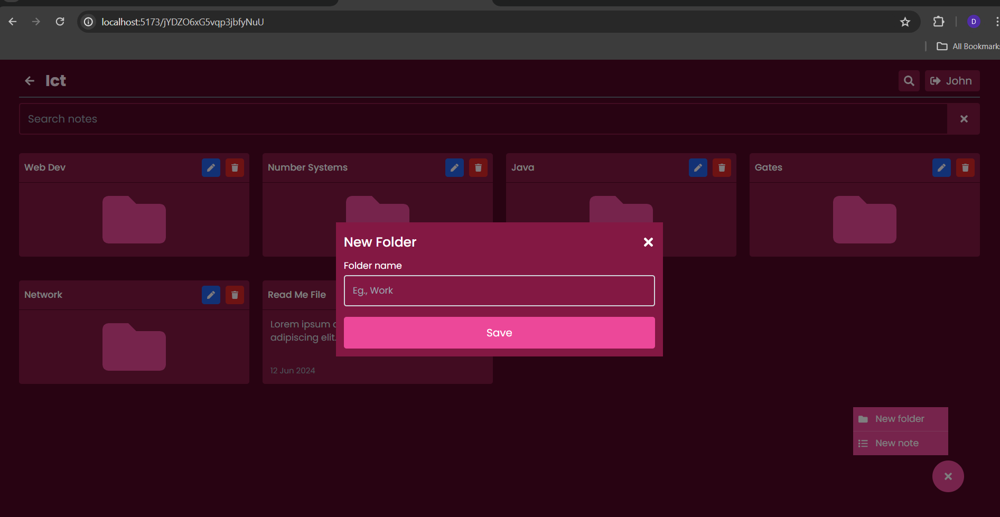

### NoteNova

## Technologies

- React.js for frontend
- Firebase for backend

## Deployment

Access the live version of the app at <a href="https://notes-app-a3759.web.app/">here</a>.

## Features

- Authentication: Login and register using either email/password or Google account.

- Folder Management: Create, edit, delete, and view folders to categorize and store notes.

- Nested Folders: Create nested folders/subfolders, enabling hierarchical organization.

- Note Management: Create, edit, delete, and view notes.

- Text Formatting: Create text with bold, italic, underline, lists, images, and hyperlinks.

- Search Functionality: Easily find notes and folders.

- Responsive Design: Optimized for all screen sizes.

## Screenshots

 
 
 
 
 
 
 
 
 
 

