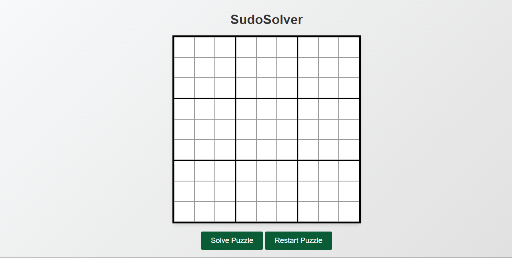

<h1 align='center'><b>💥 SUDOKU SOLVER 💥</b></h1>

<!-- -------------------------------------------------------------------------------------------------------------- -->

<h3 align='center'>Tech Stack Used 🎮</h3>
<!-- enlist all the technologies used to create this project from them (Remove comment using 'ctrl+z' or 'command+z') -->

  

<!-- -------------------------------------------------------------------------------------------------------------- -->

## :zap: Description 📃

  <!-- 
Add Description of the project
 -->
    
This is a react.js project that Solves Sudoku Automatically on input of numbers in the grid.

<!-- -------------------------------------------------------------------------------------------------------------- -->

## :zap: How to run it? 🕹️

<!-- Add steps how to run this project -->
To run this project locally, follow these steps:

1. Fork the repository.

2. Clone the repository to your local computer:
    git clone https://github.com/your-username/Sudoku-Solver.git

3. Open the project folder in your preferred code editor, now you can view website in live.

<!-- -------------------------------------------------------------------------------------------------------------- -->

## :zap: Screenshots 📸
<!-- add the screenshot of the project (Mandatory) -->

<!-- -------------------------------------------------------------------------------------------------------------- -->

<h4 align='center'>Developed By <b><i>Anantesh G</i></b> 👦</h4>

  
  

<h4 align='center'>Happy Coding 🧑‍💻</h4>

<h3 align="center">Show some &nbsp;❤️&nbsp; by &nbsp;🌟&nbsp; this repository!</h3>