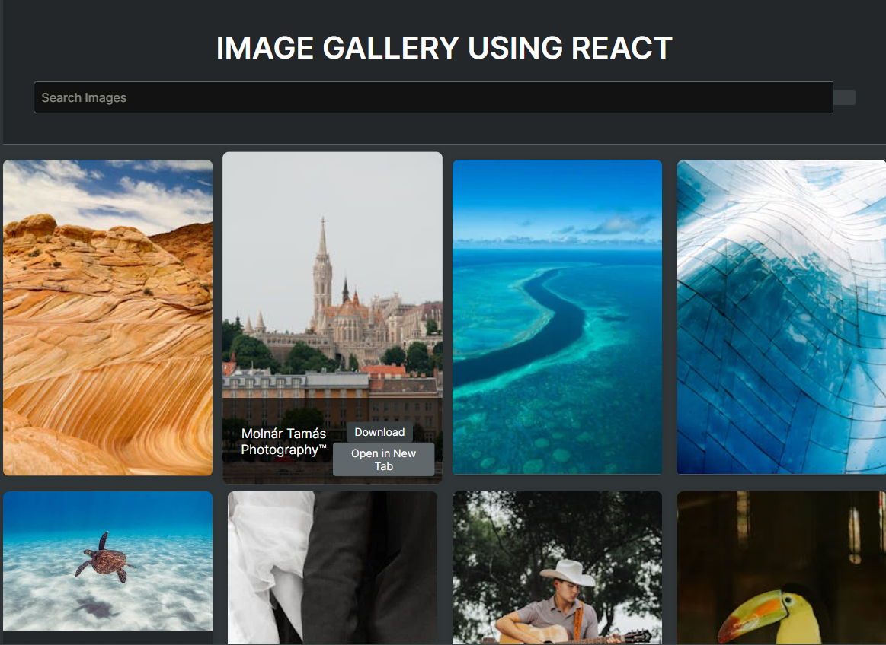

<h1 align='center'><b>💥 IMAGE GENERATOR IN REACT.JS 💥</b></h1>

<!-- -------------------------------------------------------------------------------------------------------------- -->

<h3 align='center'>Tech Stack Used 🎮</h3>
<!-- Remove comment using 'ctrl+z' or 'command+z' to enlist all the technologies used to create this project -->

  

<!-- -------------------------------------------------------------------------------------------------------------- -->

## :zap: Description 📃

This project is an Image Generator built with React. It fetches images from the Pexels API based on user search queries and displays them in a gallery format. Users can search for images using keywords and view them in a lightbox for a larger preview.

<!-- -------------------------------------------------------------------------------------------------------------- -->

# :zap: How to run it? 🕹️

<!-- Add steps how to run this project -->

To run this project locally, follow these steps:

1. Fork the repository.

2. Clone the repository to your local computer

3. Open the project folder in your preferred code editor, now you can view website in live.

<!-- -------------------------------------------------------------------------------------------------------------- -->

## :zap: Screenshots 📸
<!-- add the screenshot of the project (Mandatory) -->

<!-- -------------------------------------------------------------------------------------------------------------- -->

<h4 align='center'>Developed By <b><i>ISHITHA JAIN</i></b> 👦</h4>

  
  

<h4 align='center'>Happy Coding 🧑‍💻</h4>

<h3 align="center">Show some &nbsp;❤️&nbsp; by &nbsp;🌟&nbsp; this repository!</h3>
