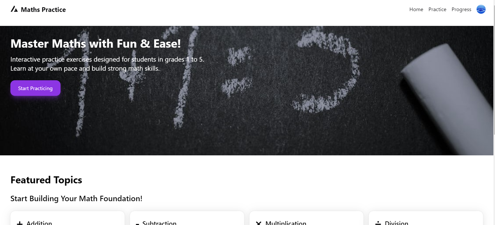
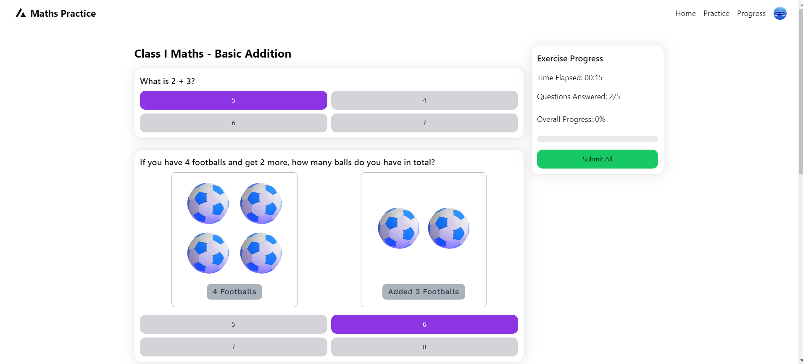
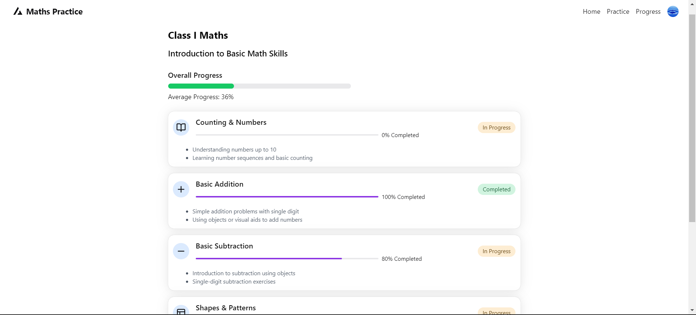
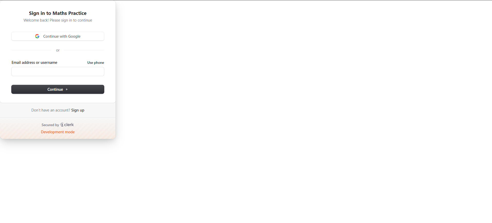
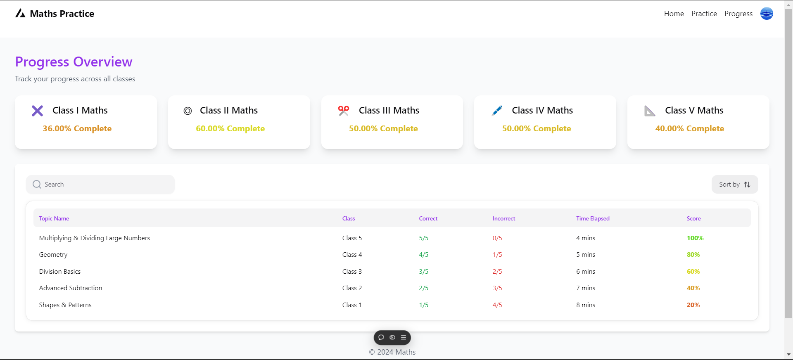
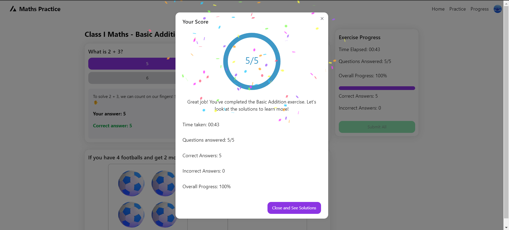

<h1 align='center'><b>💥 Maths Practice Website 💥</b></h1>

<h3 align='center'>Tech Stack Used 🎮</h3>

<div align='center'>
  
  
  
  
  
  
</div>

---

## :zap: Description 📃

This is a website designed for students in classes 1 to 5 to practice math by solving curated questions. The difficulty of the questions increases as students advance through different classes. It features image-based questions, progress tracking, and authentication options.

## :zap: Features 🚀

- Curated math questions for classes 1 to 5
- Image-based questions for interactive learning
- Progress tracking (currently using LocalStorage)
- Dynamic difficulty based on class level
- Authentication using Clerk and Google OAuth
- Deployed on Vercel

## :zap: How to run it? 🕹️

Steps to run this website on your local machine:

1. Fork this repository
2. Clone the repository to your local machine
3. Open terminal
4. Navigate to the project directory
5. Enter these commands in the terminal:
   ```
   npm install
   npm run dev
   ```
6. Make sure you have Node.js installed before running these commands and for env var pls contact me.

## :zap: Screenshots 📸








---

<h4 align='center'>Visit the website at <a href="https://maths.shravandeepyadav.com">maths.shravandeepyadav.com</a></h4>

<h4 align='center'>Developed By <b><i>Shravandeep Yadav</i></b> 👦</h4>
<p align='center'>
  <a href="https://www.linkedin.com/in/shravandeep-yadav-94ab6222b/">
    
  </a>
  <a href="https://github.com/Spy156">
    
  </a>
</p>

<h4 align='center'>Happy Coding 🧑‍💻</h4>

<h3 align="center">Show some &nbsp;❤️&nbsp; by &nbsp;🌟&nbsp; this repository!</h3>
