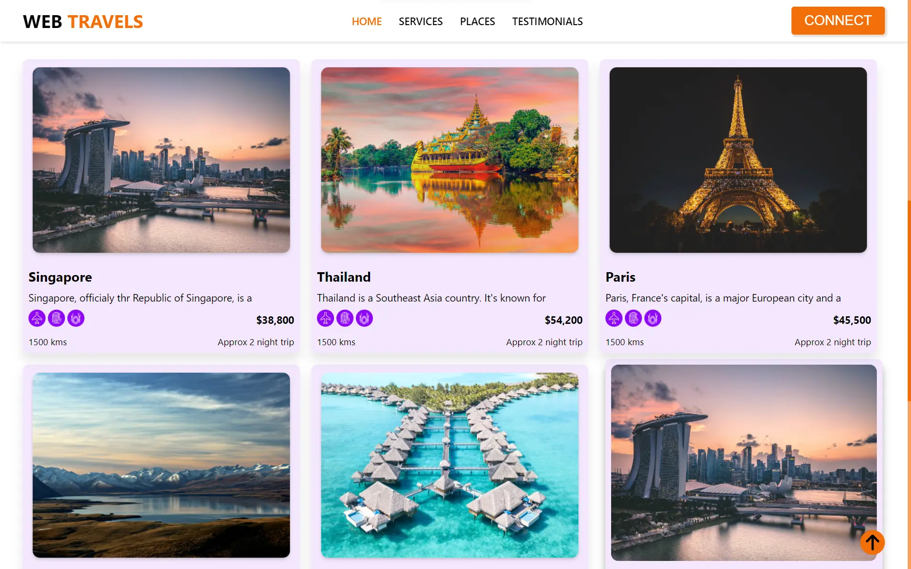

<h1 align='center'><b>💥 Travel-Website 💥</b></h1>

<!-- -------------------------------------------------------------------------------------------------------------- -->

<h3 align='center'>Tech Stack Used 🎮</h3>

<div align='center'>

  
  
  
</div>


<!-- -------------------------------------------------------------------------------------------------------------- -->

<h3 align='center'>Description 📃</h3>

<div align='center'>
    <p>"Welcome to Web-Travels, where adventure meets comfort, and every journey becomes a cherished memory. As passionate travelers ourselves, we understand the thrill of exploration and the desire for seamless, unforgettable experiences. Whether you seek the tranquility of exotic landscapes, the excitement of bustling cities, or the charm of cultural treasures, our curated selection of destinations promises to fulfill every traveler's dream. Immerse yourself in a world of personalized itineraries, handpicked accommodations, and expert guidance, ensuring that each trip with us is a voyage of discovery and delight. Discover the world with confidence, knowing that our commitment to excellence and your satisfaction is our top priority. Your adventure begins here!"
</p>
</div>

<!-- -------------------------------------------------------------------------------------------------------------- -->

<h3 align='center'>How to run this Project? 🕹️</h3>

<div >
    <p>To run this project locally, follow these steps:

# Fork the repository
   
# Open your terminal and then type:
```
$ git clone {the url to the GitHub repo}
```
# Navigate to the project directory:
```
cd <repo-name>
```
# Install dependencies:
```
$ npm install
```
# Start the development server:
```
$ npm run dev
```
</p>
</div>

<!-- -------------------------------------------------------------------------------------------------------------- -->

<h3 align='center'>Screenshot📸</h3>

 


<!-- -------------------------------------------------------------------------------------------------------------- -->

<h4 align='center'>Developed By <b><i>Vishal Malyan</i></b></h4>
<p align='center'>
  <a href='https://www.linkedin.com/in/vishal-malyan-a5204625b'>
    
  </a>
  <a href='https://github.com/vishal2005025'>
    
  </a>
</p>

<h4 align='center'>Happy Coding 🧑‍💻</h4>

<h3 align="center">Show some &nbsp;❤️&nbsp; by &nbsp;🌟&nbsp; this repository!</h3>
