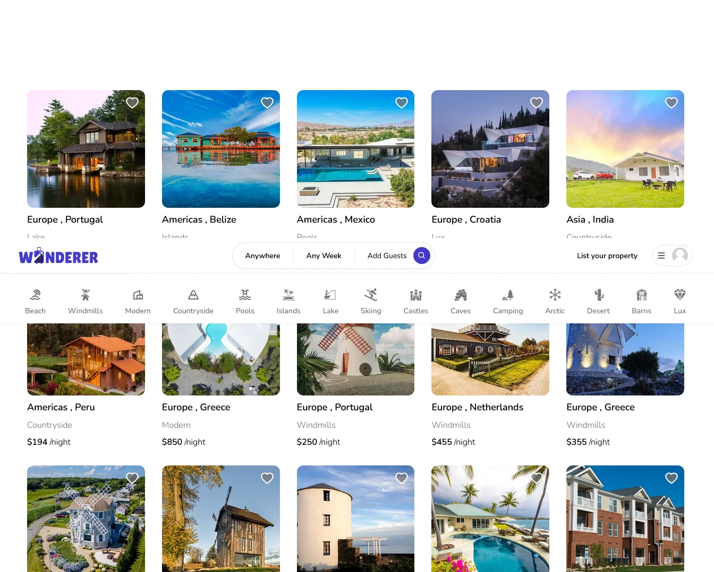

<h1 align='center'><b>💥 Rental Website 💥</b></h1>

<!-- -------------------------------------------------------------------------------------------------------------- -->

<h3 align='center'>Tech Stack Used 🎮</h3>

<div align='center'>
  
</div>


<!-- -------------------------------------------------------------------------------------------------------------- -->

## :zap: Description 📃

<div align='center'>
    <p>A property rental website where you can list your property or rent other properties with ease. </p>
</div>

<!-- -------------------------------------------------------------------------------------------------------------- -->

## :zap: How to run it? 🕹️

First, run the development server:

```bash
npm run dev
# or
yarn dev
# or
pnpm dev
```

Open [http://localhost:3000](http://localhost:3000) with your browser to see the result.

You can start editing the page by modifying `app/page.tsx`. The page auto-updates as you edit the file.

This project uses [`next/font`](https://nextjs.org/docs/basic-features/font-optimization) to automatically optimize and load Inter, a custom Google Font.

<!-- -------------------------------------------------------------------------------------------------------------- -->

## :zap: Screenshots 📸
<!-- add the screenshot of the project (Mandatory) -->




<!-- -------------------------------------------------------------------------------------------------------------- -->

<h4 align='center'>Developed By <b><i>Aditi Jain</i></b></h4>
<p align='center'>
  <a href='https://github.com/Aditijainnn'>
    
  </a>
</p>

<h4 align='center'>Happy Coding 🧑‍💻</h4>

<h3 align="center">Show some &nbsp;❤️&nbsp; by &nbsp;🌟&nbsp; this repository!</h3>

