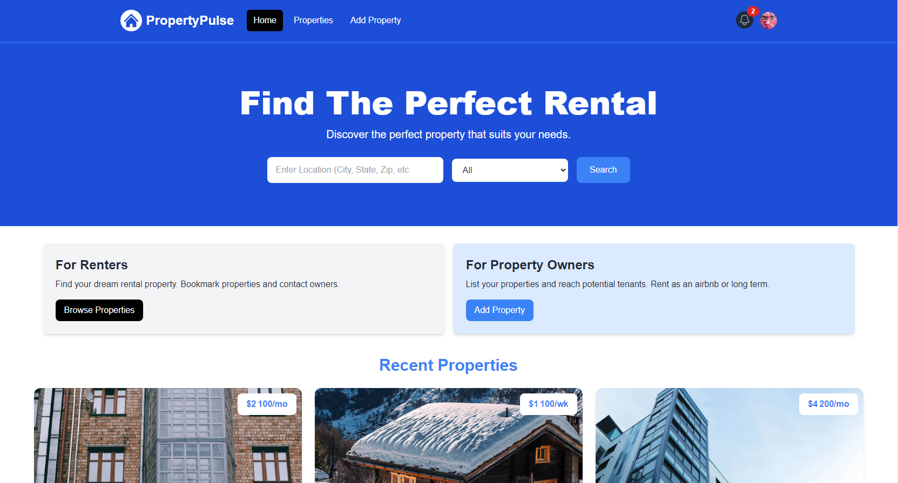

<h1 align='center'><b>💥Property Rental Website 💥</b></h1>

<!-- -------------------------------------------------------------------------------------------------------------- -->

<h3 align='center'>Tech Stack Used 🎮</h3>

   
  

<!-- -------------------------------------------------------------------------------------------------------------- -->

## :zap: Description 📃

  
A property rental website using Tailwind CSS, MongoDB, and TypeScript

<!-- -------------------------------------------------------------------------------------------------------------- -->

## :zap: How to run it? 🕹️

  
To run this project locally, follow these steps:

- Fork this repository.
- Clone the forked repository.
- setting up the project with Tailwind CSS and TypeScript.
- implementing a responsive navbar with React Icons.
- integrating homepage components.
- crafting a property card component to showcase available properties.
- designing a custom 404 page and incorporating loading spinners from React Spinners.
- establishing a MongoDB Atlas database.
- creating an API route.
- constructing Property and User models using Mongoose and TypeScript.
- fetching data in a server component.
- setting up NextAuth.js with Google OAuth.
- handling user sessions, with the ability to sign in and out.
- ensuring that certain routes are accessible only to authenticated users.
- handling the property submission form.
- implementing Cloudinary for image storage and optimization.
- presenting user profile information and listings.
- offering capabilities for editing and deleting listings.
- integrating React Toastify for displaying user-friendly notifications.
- integrating Mapbox to handle geocoding and maps.
- implementing a bookmarking system that enables users to save their favorite properties.
- adding social share buttons using react-share.
- handling searches by location and property type.
- implementing a messaging system that allows users to send, view, and manage messages, featuring message notifications.
- managing pagination.
- displaying images in a lightbox with react-photoswipe-gallery.
- displaying featured properties.

<!-- -------------------------------------------------------------------------------------------------------------- -->

## :zap: Screenshots 📸
<!-- add the screenshot of the project (Mandatory) -->

<!-- -------------------------------------------------------------------------------------------------------------- -->

<h4 align='center'>Developed By <b><i>Aditi</i></b></h4>

  

<h4 align='center'>Happy Coding 🧑‍💻</h4>

<h3 align="center">Show some &nbsp;❤️&nbsp; by &nbsp;🌟&nbsp; this repository!</h3>

