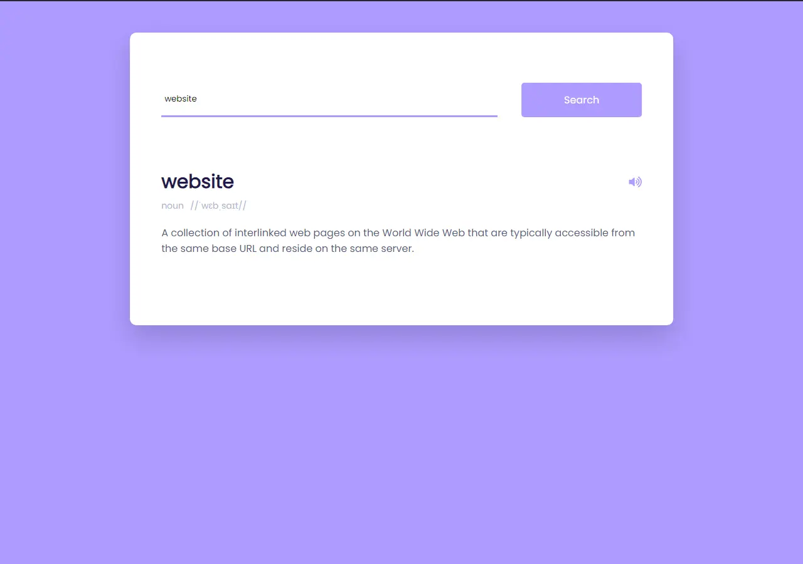

<h1 align='center'><b>📖 Dictionary App 🔍</b></h1>

<!-- -------------------------------------------------------------------------------------------------------------- -->

<h3 align='center'>Tech Stack Used 🛠️</h3>

  
  
  

<!-- -------------------------------------------------------------------------------------------------------------- -->

## 💡 Description ℹ️

- A simple and interactive dictionary application.
- Allows users to search for words and get definitions, phonetics, and examples.
- Includes a feature to play pronunciation audio for the searched word.

<!-- -------------------------------------------------------------------------------------------------------------- -->

## 🚀 How to Use 🕹️

- Clone the repository or download the ZIP file.
- Open `index.html` in your web browser.
- Type a word in the search box and click "Search" to retrieve the word's definition, phonetics, and examples.
- Click the speaker icon to listen to the pronunciation of the word.

<!-- -------------------------------------------------------------------------------------------------------------- -->

## 📷 Screenshots 📸

<!-- Add screenshots or demo GIFs of your application -->

<!-- -------------------------------------------------------------------------------------------------------------- -->

<h4 align='center'>Developed By <b><i>Vijay Shanker Sharma</i></b> 👨‍💻</h4>

  
  

<h4 align='center'>Happy Searching! 🔍</h4>

<h3 align="center">Show some &nbsp;❤️&nbsp; by &nbsp;🌟&nbsp; this repository!</h3>
