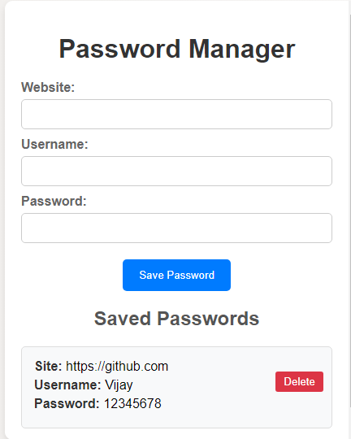

<h1 align='center'><b>🔒 Password Manager 🔑</b></h1>

<!-- -------------------------------------------------------------------------------------------------------------- -->

<h3 align='center'>Tech Stack Used 🛠️</h3>

  
  
  

<!-- -------------------------------------------------------------------------------------------------------------- -->

## 💡 Description ℹ️

- Simple and secure password manager.
- Allows users to store and manage passwords locally in the browser.
- Features include adding, viewing, and deleting passwords with dynamic updates.

<!-- -------------------------------------------------------------------------------------------------------------- -->

## 🚀 How to Use 🕹️

- Clone the repository or download the ZIP file.
- Open `index.html` in your web browser.

<!-- -------------------------------------------------------------------------------------------------------------- -->

## 📷 Screenshots 📸

<!-- Add screenshots or demo GIFs of your application -->

<!-- -------------------------------------------------------------------------------------------------------------- -->

<h4 align='center'>Developed By <b><i>Vijay Shanker Sharma</i></b> 👨‍💻</h4>

  
  

<h4 align='center'>Happy Securing! 🔐</h4>

<h3 align="center">Show some &nbsp;❤️&nbsp; by &nbsp;🌟&nbsp; this repository!</h3>
