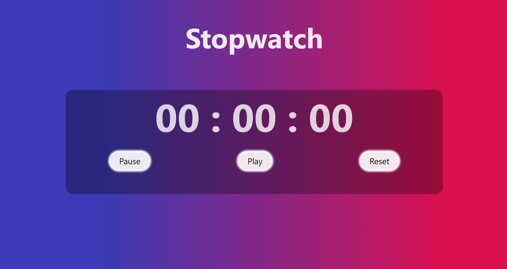

<h1 align='center'><b>💥 Stopwatch 💥</b></h1>

<!-- -------------------------------------------------------------------------------------------------------------- -->

<h3 align='center'>Tech Stack Used 🎮</h3>
<!-- enlist all the technologies used to create this project from them (Remove comment using 'ctrl+z' or 'command+z') -->

  
  
  

<!-- -------------------------------------------------------------------------------------------------------------- -->

## :zap: Description 📃

- Beginner friendly project.
- The project is a sleek and efficient stopwatch application built using HTML, CSS, and JavaScript.
- Designed with simplicity and functionality in mind, it allows users to accurately track time with precision.

<!-- -------------------------------------------------------------------------------------------------------------- -->

## :zap: How to run it? 🕹️

<!-- add the steps how to run the project -->
- Fork this project and run the `index.html` file directly.

<!-- -------------------------------------------------------------------------------------------------------------- -->

## :zap: Screenshots 📸
<!-- add the screenshot of the project (Mandatory) -->

<!-- -------------------------------------------------------------------------------------------------------------- -->

<h4 align='center'>Developed By <b><i>Abirami Gurushanker</i></b> 👧</h4>

  
  

<h4 align='center'>Happy Coding 🧑‍💻</h4>

<h3 align="center">Show some &nbsp;❤️&nbsp; by &nbsp;🌟&nbsp; this repository!</h3>
