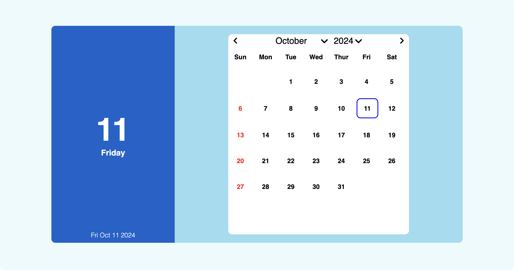

<h1 align='center'><b>💥 Calendar App 💥</b></h1>

<!-- -------------------------------------------------------------------------------------------------------------- -->

<h3 align='center'>Tech Stack Used 🎮</h3>

  
  
  <!--  -->
  
  <!--  -->
  <!--  -->
  <!--  -->
  <!--  -->
  <!--  -->
  <!--  -->
  <!--  -->
  <!--  -->
  <!--  -->
  <!--  -->
  <!--  -->

<!-- -------------------------------------------------------------------------------------------------------------- -->

## :zap: Description 📃

  This web application is simple HTML, CSS, JavaScript Calendar Application designed to display and navigate through months and years, with functionality for viewing dates, days of the week, and the current day.
    

<!-- -------------------------------------------------------------------------------------------------------------- -->

## :zap: How to run it? 🕹️

<!-- Add steps how to run this project -->

  
To run this project locally, follow these steps:
- Fork the repository
- Clone the repository to your local machine:
    git clone https://github.com/your-username/Calendar-App.git
- Open the project folder in your preferred code editor.
- Run `index.html` using Live Server

<!-- -------------------------------------------------------------------------------------------------------------- -->

## :zap: Screenshots 📸

<!-- -------------------------------------------------------------------------------------------------------------- -->

<h4 align='center'>Developed By <b><i>Shalini Bhandari</i></b> 👦</h4>

  
  

<h4 align='center'>Happy Coding 🧑‍💻</h4>

<h3 align="center">Show some &nbsp;❤️&nbsp; by &nbsp;🌟&nbsp; this repository!</h3>

