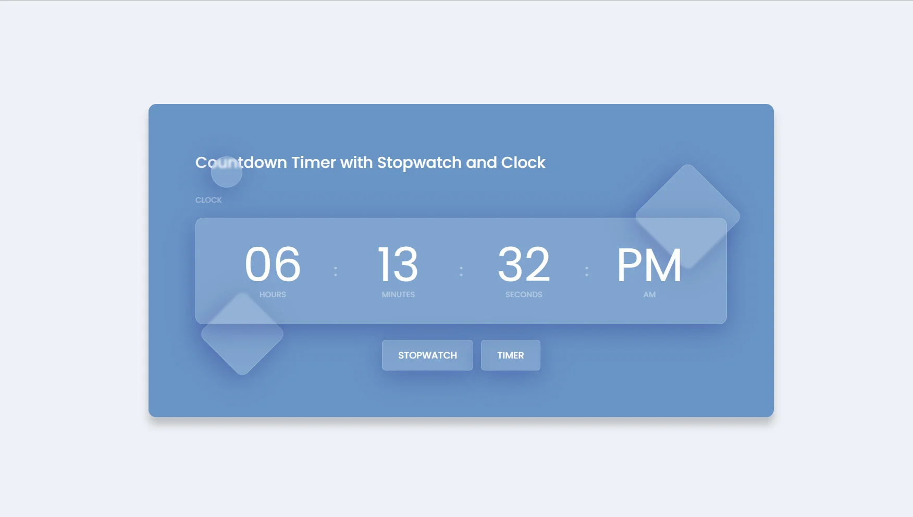
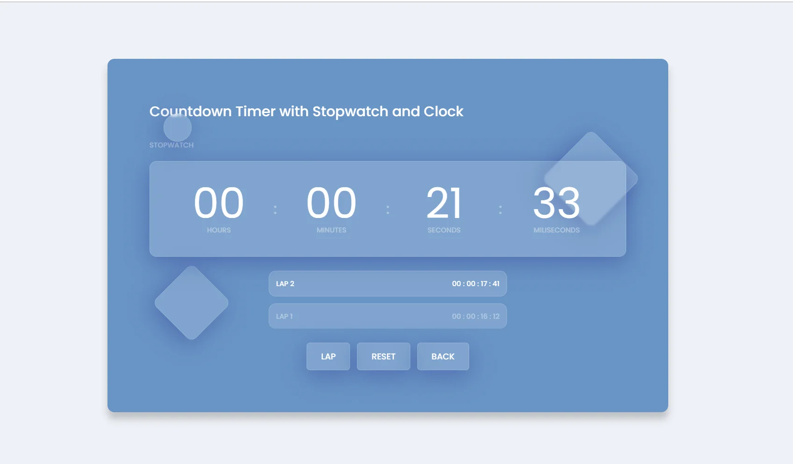
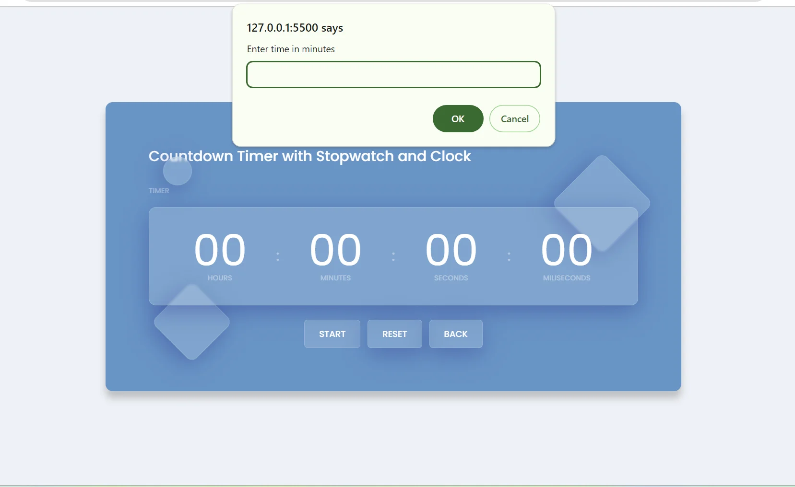

<h1 align='center'><b>💥 Countdown-Timer 💥</b></h1>

<!-- -------------------------------------------------------------------------------------------------------------- -->

<h3 align='center'>Tech Stack Used 🎮</h3>

  
  
  

<!-- -------------------------------------------------------------------------------------------------------------- -->

<h3 align='center'>Description 📃</h3>

    
This project is a simple vanilla javascript implementation of Countdown Timer with stopwatch and clock . This project have a COUNTDOWN TIMER  that counts down time from a given number with stop and reset option . Also this project have a CLOCK which displays time on the front of the webpage and a STOPWATCH with lap and reset option.
      Its aim is to manage time.

<!-- -------------------------------------------------------------------------------------------------------------- -->

<h3 align='center'>How to run this Project? 🕹️</h3>

    
To run this project locally, follow these steps:

1. Fork the repository.

2. Clone the repository to your local computer:
    git clone https://github.com/your-username/Countdown-Timer-Clone.git

3. Open the project folder in your preferred code editor, now you can view website in live.

<!-- -------------------------------------------------------------------------------------------------------------- -->

<h3 align='center'>Screenshot📸</h3>
1. 

2. 

3. 

<!-- -------------------------------------------------------------------------------------------------------------- -->

<h4 align='center'>Developed By <b><i>Vishal Malyan</i></b></h4>

  
  

<h4 align='center'>Happy Coding 🧑‍💻</h4>

<h3 align="center">Show some &nbsp;❤️&nbsp; by &nbsp;🌟&nbsp; this repository!</h3>
