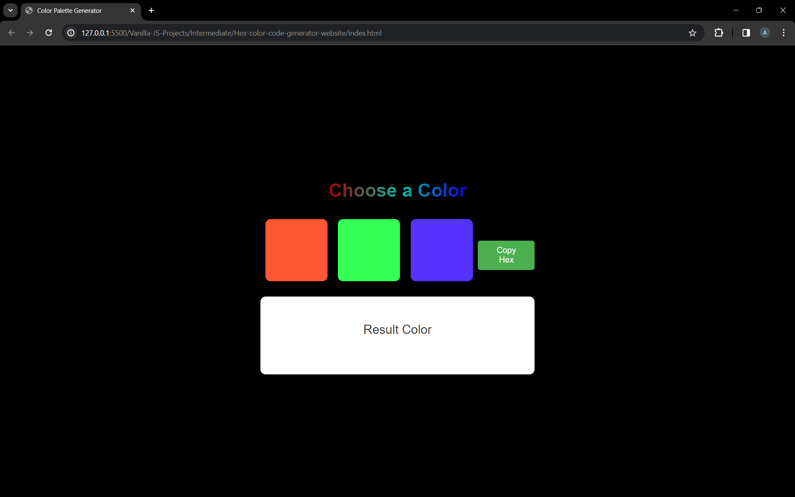

<h1 align='center'><b>💥 Hex Color Code Generator Website 💥</b></h1>

<!-- -------------------------------------------------------------------------------------------------------------- -->

<h3 align='center'>Tech Stack Used 🎮</h3>

   
  
  
  
  

<!-- -------------------------------------------------------------------------------------------------------------- -->

<h3 align='center'>Description 📃</h3>

    

Heading Styling: Added an attractive heading with the class heading to the webpage. The heading uses a gradient background with vibrant colors and a text shadow effect to enhance its visual appeal.

Color Palette Display: Implemented a color palette display using three color boxes (colorBox) representing different colors. Users can click on these color boxes to select or deselect them.

Result Color: Added a result color display area (resultColor) below the color palette. It dynamically updates based on the selected colors, showing the mixed color resulting from the combination of selected colors.

Copy Hex Button: Included a "Copy Hex" button styled with a green background color and white text. When clicked, this button copies the hexadecimal code of the resulting color to the user's clipboard.

Interactive Features: Utilized JavaScript to add interactivity to the color palette generator. Users can click on the color boxes to select or deselect colors, and the result color updates in real-time based on the selected colors.

Gradient Background: Enhanced the overall visual appeal of the website by updating the background color to a soothing shade that complements the color palette and heading gradient.
    

<!-- -------------------------------------------------------------------------------------------------------------- -->

<h3 align='center'>How to run it? 🕹️</h3>

    

To run this project locally, follow these steps:

1. Fork the repository.

2. Clone the repository to your local machine:

git clone https://github.com/your-username/hex-code-gen.git

3. Open the project folder in your preferred code editor.
    

<!-- -------------------------------------------------------------------------------------------------------------- -->

<h3 align='center'>Screenshots 📸</h3>

<h3 align='center'>Working Video 📹</h3>

https://github.com/AryanPahuja21/WebMasterLog/assets/139960070/42f86ce2-8110-48af-aae9-d729174d568a

<!-- -------------------------------------------------------------------------------------------------------------- -->

<h4 align='center'>Developed By <b><i>Aryan Pahuja</i></b> 👦</h4>

  
  

<h4 align='center'>Happy Coding 🧑‍💻</h4>

<h3 align="center">Show some &nbsp;❤️&nbsp; by &nbsp;🌟&nbsp; this repository!</h3>
