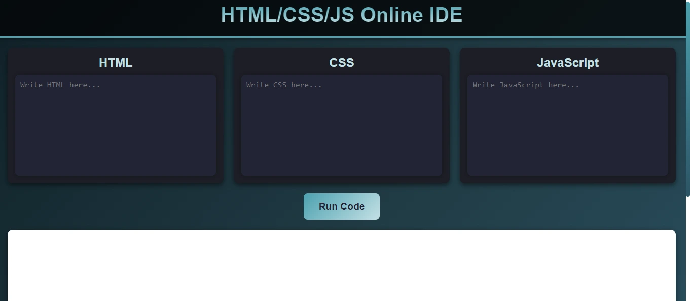

<h1 align='center'><b>💻 Online IDE for HTML, CSS, and JavaScript 💻</b></h1>

<!-- -------------------------------------------------------------------------------------------------------------- -->

<h3 align='center'>Tech Stack Used 🎮</h3>

  
  
  

<!-- -------------------------------------------------------------------------------------------------------------- -->

## :zap: Description 📃

    
An online IDE for writing and testing HTML, CSS, and JavaScript code in real-time. This tool allows users to create and preview web projects directly in the browser.

<!-- -------------------------------------------------------------------------------------------------------------- -->

## :zap: How to run it? 🕹️

- Clone this repository.
- Navigate to the project directory.
- Open `index.html` in your browser.
- Start writing and testing your HTML, CSS, and JavaScript code directly in the IDE.

<!-- -------------------------------------------------------------------------------------------------------------- -->

## :zap: Features 🛠️

- Real-time preview of HTML, CSS, and JavaScript.
- Easy-to-use code editor for beginners and advanced users.
- Lightweight and runs directly in the browser without the need for external plugins.

<!-- -------------------------------------------------------------------------------------------------------------- -->

## :zap: Screenshots 📸

<!-- Add a screenshot of your online IDE project here -->

<!-- -------------------------------------------------------------------------------------------------------------- -->

<h4 align='center'>Developed By <b><i>Ananya Gupta</i></b> 👨‍💻</h4>

  

<h4 align='center'>Happy Coding 🧑‍💻</h4>

<h3 align="center">Show some &nbsp;❤️&nbsp; by &nbsp;🌟&nbsp; this repository!</h3>
