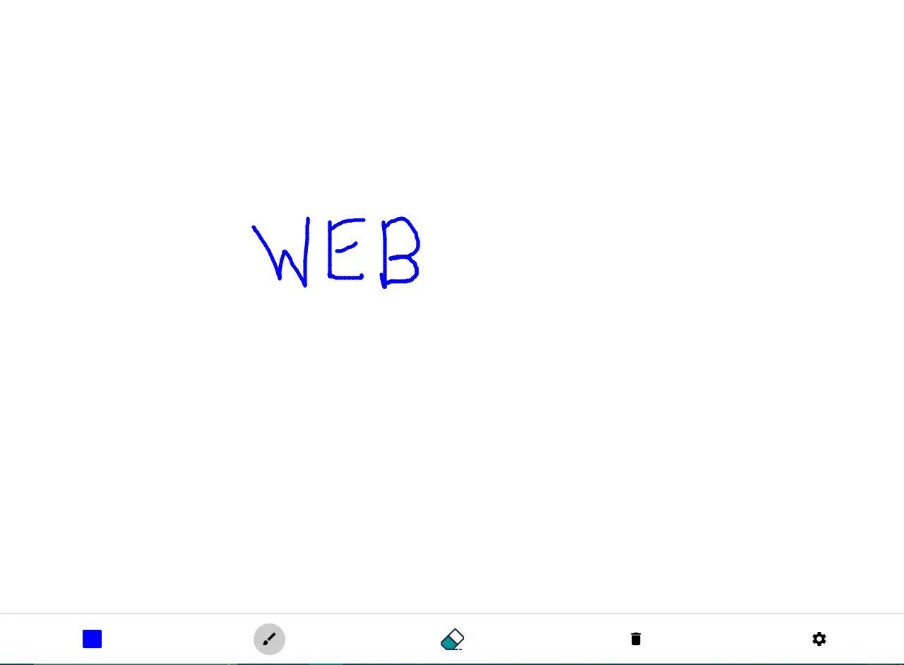

<h1 align='center'><b>🎨 Paint App 🖌️</b></h1>

<!-- -------------------------------------------------------------------------------------------------------------- -->

<h3 align='center'>Tech Stack Used 🛠️</h3>

  
  
  

<!-- -------------------------------------------------------------------------------------------------------------- -->

## 💡 Description ℹ️

- A versatile paint application for creative expression.
- Features a drawing canvas with options to select colors, pen sizes, and tools.
- Includes tools for drawing, erasing, and clearing the canvas.
- Utilizes a color picker for customizing pen colors and a slider for adjusting stroke width.

<!-- -------------------------------------------------------------------------------------------------------------- -->

## 🚀 How to Use 🕹️

- Clone the repository or download the ZIP file.
- Open `index.html` in your web browser to launch the application.
- Use the toolbar at the bottom to select tools and customize your drawing experience:
  - **Color Picker**: Click to choose your pen color.
  - **Pen Tool**: Click to switch to the pen tool.
  - **Eraser Tool**: Click to switch to the eraser tool.
  - **Clear Canvas**: Click to clear the entire canvas.
  - **Settings**: Click to adjust stroke width.

<!-- -------------------------------------------------------------------------------------------------------------- -->

## 📷 Screenshots 📸

<!-- Add screenshots or demo GIFs of your application -->

<!-- -------------------------------------------------------------------------------------------------------------- -->

## 💻 Files Overview 📂

- **`index.html`**: The main HTML file containing the layout and structure of the app.
- **`style.css`**: The CSS file for styling the application.
- **`script.js`**: The JavaScript file handling the application’s logic, including tool selection and drawing functionality.

<!-- -------------------------------------------------------------------------------------------------------------- -->

<h4 align='center'>Developed By <b><i>Vijay Shanker Sharma</i></b> 👨‍💻</h4>

  
  

<h4 align='center'>Happy Painting! 🎨</h4>

<h3 align="center">Show some &nbsp;❤️&nbsp; by &nbsp;🌟&nbsp; this repository!</h3>
