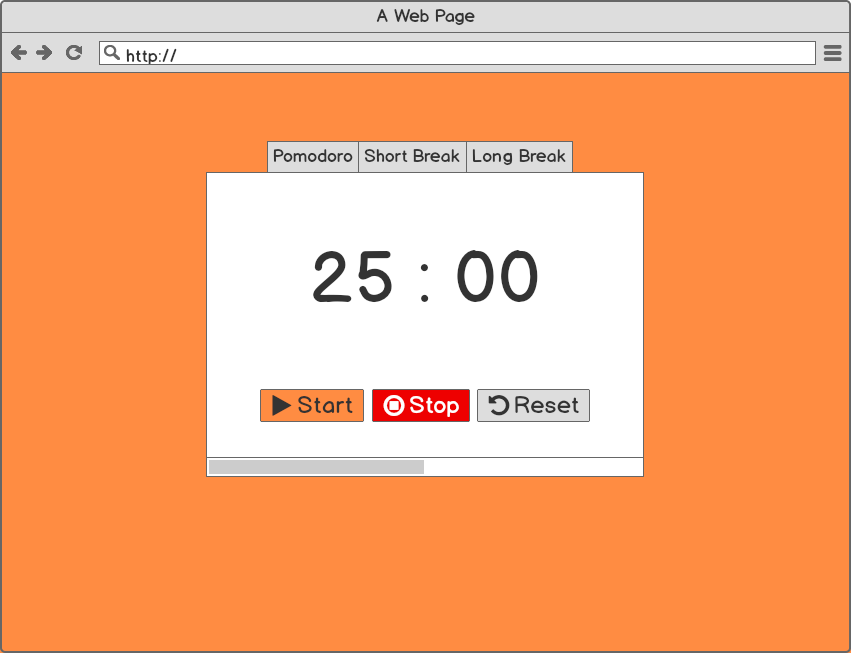

<h1 align='center'><b>💥Pomodoro Clock💥</b></h1>

<!-- ----------------------------------------------------------------------------------------------------- -->

<h3 align='center'>Tech Stack Used 🎮</h3>
<!-- enlist all the technologies used to create this project from them (Remove comment using 'ctrl+z' or 'command+z') -->

<div align='center'>


  
  
</div>


<!----------------------------------------------------------------------------------------------------------->

## ⚡ Description 📃

<div>
  <!-- <p>Add Description of the project</p> -->
    <p>User can start timer, can stop timer, can choose timer, short break, or long break, can see progress bar, can see seconds count down, can set number of minutes for each type of timer and add tasks at the bottom it also had dark theme and light toggle theme.</p>
</div>

<!-- -------------------------------------------------------------------------------------------------------------- -->

## ⚡ How to run it? 

<!-- Add steps how to run this project -->
<p>
To run this project locally, follow these steps:

1. Fork the repository.

2. Clone the repository to your local machine:
    git clone https://github.com/your-username/Pomodoro-Clock-using-Vue-JS.git

## Project setup
```
npm install
```

### Compiles and hot-reloads for development
```
npm run serve
```

### Compiles and minifies for production
```
npm run build
```

### Lints and fixes files
```
npm run lint
```

</p>
<!-- -------------------------------------------------------------------------------------------------------------- -->

## ⚡ Screenshots 📸

<>


<!-- ----------------------------------------------------------------------------------------------------- -->


<h3 align="center">Show some &nbsp;❤️&nbsp; by &nbsp;🌟&nbsp; this repository!</h3>
