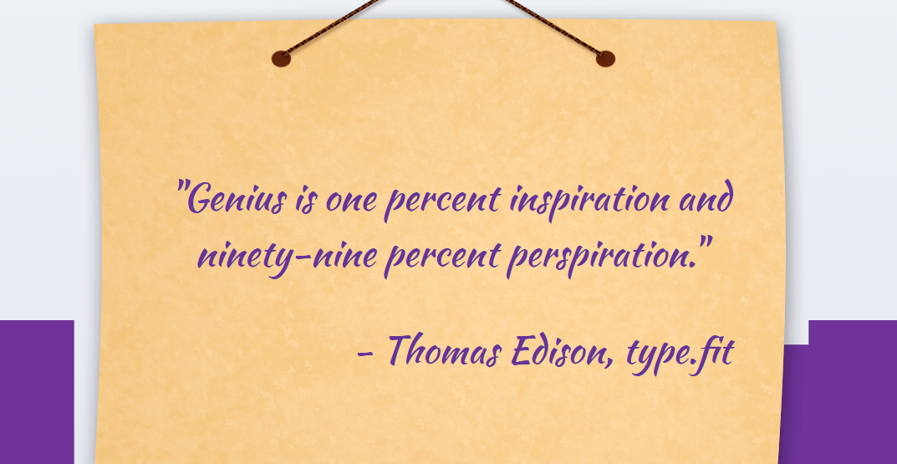

<h1 align='center'><b>💥 Quote Generator💥</b></h1>

<!-- ----------------------------------------------------------------------------------------------------- -->

<h3 align='center'>Tech Stack Used 🎮</h3>
<!-- enlist all the technologies used to create this project from them (Remove comment using 'ctrl+z' or 'command+z') -->

  
  

<!----------------------------------------------------------------------------------------------------------->

## ⚡ Description 📃

  <!-- 
Add Description of the project
 -->
    
This is random quote generator project build with HTML, CSS, and Vue.js via CDN imports. Bootstrap also provides some styling assistance.

<!-- -------------------------------------------------------------------------------------------------------------- -->

## ⚡ How to run it? 

<!-- Add steps how to run this project -->

To run this project locally, follow these steps:

1. Fork the repository.

2. Clone the repository to your local machine:
    git clone https://github.com/your-username/Quote-Generator-using-Vue-JS.git

3. Open the project folder in your preferred code editor, now you can view website in live.

<!-- -------------------------------------------------------------------------------------------------------------- -->

## ⚡ Screenshots 📸

<!-- ----------------------------------------------------------------------------------------------------- -->

<h4 align='center'>Developed By <b><i>Aditi</i></b></h4>

  
  

<h4 align='center'>Happy Coding 🧑‍💻</h4>

<h3 align="center">Show some &nbsp;❤️&nbsp; by &nbsp;🌟&nbsp; this repository!</h3>
