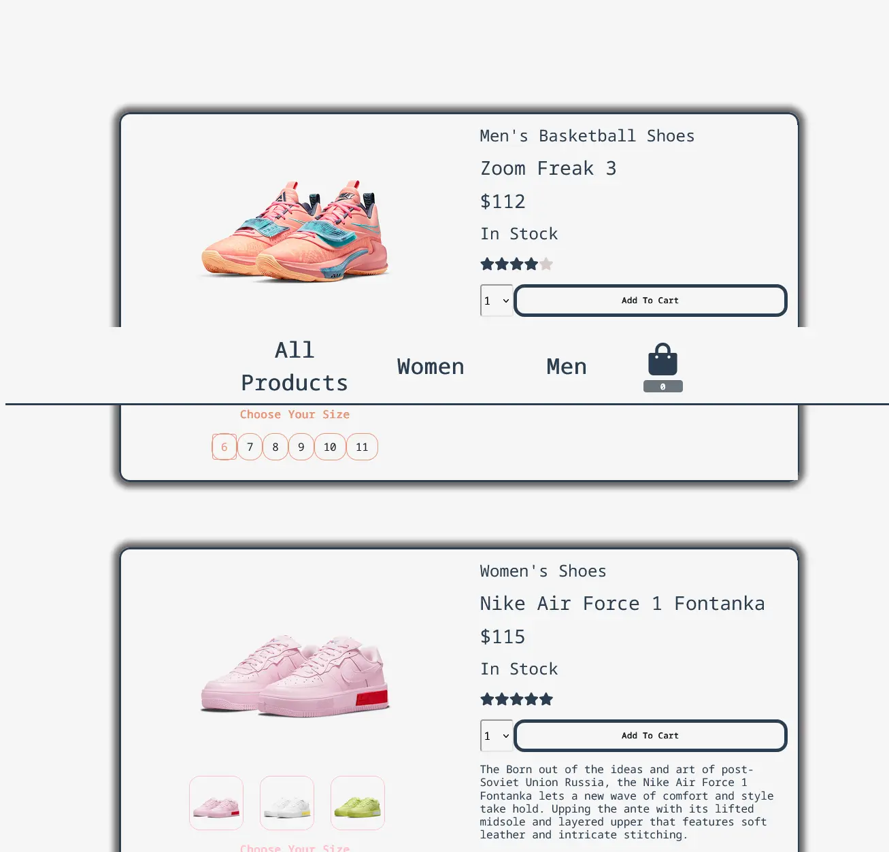

<h1 align='center'><b>💥 Shoe Website 💥</b></h1>

<!-- -------------------------------------------------------------------------------------------------------------- -->

<h3 align='center'>Tech Stack Used 🎮</h3>
<!-- enlist all the technologies used to create this project from them (Remove comment using 'ctrl+z' or 'command+z') -->

<div align='center'>

  
  
  
  

</div>


<!-- -------------------------------------------------------------------------------------------------------------- -->

## :zap: Description 📃

<div>
  <!-- <p>Add Description of the project</p> -->
    <p>An E-commerce shoe website 
</p>
</div>
</div>


<!-- -------------------------------------------------------------------------------------------------------------- -->

## :zap: How to run it? 🕹️

What can you do in this project ?

- Choose category from navigation bar. Items will be filtered.
- Choose the color of the shoe. Item's classes will apply.
- Choose the size for shoe. Price will change accordingly.
- See the rating of the shoe.
- Change the item count to add multiple items at once.
- Add To Cart button alert you when you add product.
- Add, Subtract or Delete functions apply in cart.
- You can see all the items you add in the cart.
- Total price of items shown.

### How this project handled?

    - Vue CLI
    - Vue.js
    - BootstrapVue
    - JavaScript
    - CSS
    - HTML


- Alerts can be add for Subtract and Delete functions.
- Cart can be designed better.
- Stock of items can be tracked.


## Project setup

```
npm install
```

### Compiles and hot-reloads for development

```
npm run serve
```

### Compiles and minifies for production

```
npm run build
```

### Lints and fixes files

```
npm run lint
```

### Customize configuration

See [Configuration Reference](https://cli.vuejs.org/config/).


## :zap: Screenshots 📸
<!-- add the screenshot of the project (Mandatory) -->




<!-- -------------------------------------------------------------------------------------------------------------- -->

<h4 align='center'>Developed By <b><i> Aditi Jain</i></b> 👦</h4>
<p align='center'>
  <a href='https://github.com/Aditijainnn'>
    
  </a>
</p>

<h4 align='center'>Happy Coding 🧑‍💻</h4>

<h3 align="center">Show some &nbsp;❤️&nbsp; by &nbsp;🌟&nbsp; this repository!</h3>
