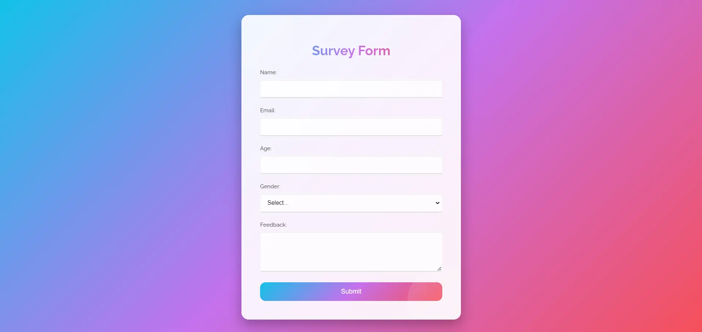

<h1 align='center'><b>💥 Survey Form 💥</b></h1>

<!-- -------------------------------------------------------------------------------------------------------------- -->

<h3 align='center'>Tech Stack Used 🎮</h3>

  
  

<!-- -------------------------------------------------------------------------------------------------------------- -->

## :zap: Description 📃

  
A survey form is a tool used to collect information or opinions from respondents, typically through a series of questions. It's often used in research, marketing, or feedback collection to gather data for analysis.

<!-- -------------------------------------------------------------------------------------------------------------- -->

## :zap: How to run it? 🕹️

    
To run this project locally, follow these steps:

1. Fork the repository.

2. Clone the repository to your local machine:
    git clone
    
3. Open the project folder in your preferred code editor, now you can view website in live.

<!-- -------------------------------------------------------------------------------------------------------------- -->

## :zap: Screenshots 📸
<!-- add the screenshot of the project (Mandatory) -->

<!-- -------------------------------------------------------------------------------------------------------------- -->

<h4 align='center'>Developed By <b><i>Khushi Pushkar</i></b></h4>

  
  

<h4 align='center'>Happy Coding 🧑‍💻</h4>

<h3 align="center">Show some &nbsp;❤️&nbsp; by &nbsp;🌟&nbsp; this repository!</h3>
