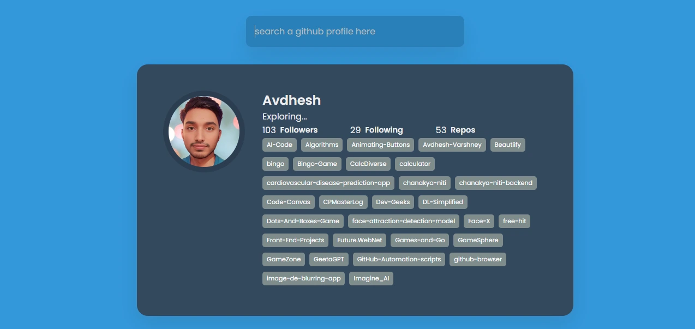

<h1 align='center'><b>📊 GitHub Profile Viewer 📊</b></h1>

<!-- -------------------------------------------------------------------------------------------------------------- -->

<h3 align='center'>Tech Stack Used 💻</h3>

<div align='center'>

  
  
  
  
  
</div>


<!-- -------------------------------------------------------------------------------------------------------------- -->

## :zap: Description 📃

<div>
  <p>The GitHub Profile Viewer is a web application that allows users to search and view GitHub profiles using the GitHub API. The app fetches user data, including repositories, followers, and other GitHub statistics, providing a sleek and professional interface to explore GitHub profiles easily.</p>
</div>

<!-- -------------------------------------------------------------------------------------------------------------- -->

## :zap: How to run it? 🕹️

1. Clone the repository to your local machine.
    ```bash
    git clone https://github.com/ananyag309/github-profile-viewer.git
    ```
2. Open the `index.html` file in your browser.
3. Enter a GitHub username in the search box and click "Search".
4. Explore the user's profile information, repositories, and followers.

<!-- -------------------------------------------------------------------------------------------------------------- -->

## :zap: Screenshots 📸
<!-- add the screenshot of the project (Mandatory) -->



<!-- -------------------------------------------------------------------------------------------------------------- -->

<h4 align='center'>Developed By <b><i>Ananya Gupta</i></b> 👦</h4>
<p align='center'>
  <a href='https://www.linkedin.com/in/ananya-gupta-123456/'>
    
  </a>
  <a href='https://github.com/ananyag309'>
    
  </a>
</p>

<h4 align='center'>Happy Coding 🧑‍💻</h4>

<h3 align="center">Show some &nbsp;❤️&nbsp; by &nbsp;🌟&nbsp; this repository!</h3>
