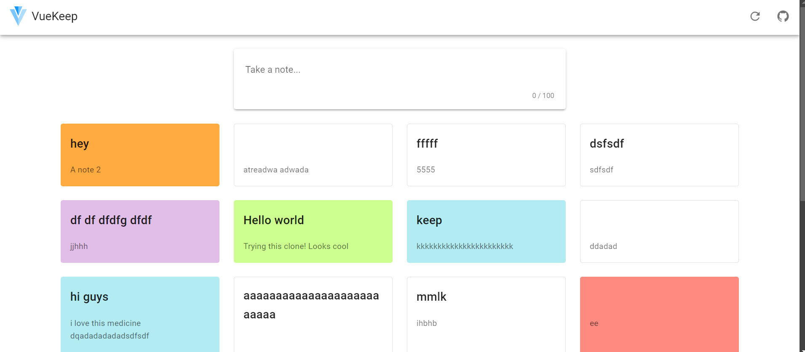

<h1 align='center'><b>💥 Google Keep 💥</b></h1>

<!-- -------------------------------------------------------------------------------------------------------------- -->

<h3 align='center'>Tech Stack Used 🎮</h3>
<!-- enlist all the technologies used to create this project from them (Remove comment using 'ctrl+z' or 'command+z') -->

<div align='center'>

  
  
  
  

</div>


<!-- -------------------------------------------------------------------------------------------------------------- -->

## :zap: Description 📃

<div>
  <!-- <p>Add Description of the project</p> -->
    <p>Google Keep is a note-taking service that allows users to quickly capture ideas, create to-do lists, and save important information in a simple and organized way. It offers features such as adding notes, lists, photos, and voice recordings, which can be easily accessed across devices through synchronization with a Google account.
</p>
</div>
</div>


<!-- -------------------------------------------------------------------------------------------------------------- -->

## :zap: How to run it? 🕹️

<!-- Add steps how to run this project -->
Steps to run this website in your local machine is as follows :
1. Fork this repository
2. Save the code on your local machine you can also clone the repository
3. Open terminal
4. Run following commands in the terminal :
```bash
# Install dependencies
$ npm install

# Compiles and hot-reloads for development
$ npm run serve

# Compiles and minifies for production
$ npm run build

# Lints and fixes files
$ npm run lint
```

<!-- -------------------------------------------------------------------------------------------------------------- -->

## :zap: Screenshots 📸
<!-- add the screenshot of the project (Mandatory) -->




<!-- -------------------------------------------------------------------------------------------------------------- -->

<h4 align='center'>Developed By <b><i>Maheshwari Love</i></b> 👦</h4>
<p align='center'>
  <a href='https://www.linkedin.com/in/maheshwari-love/'>
    
  </a>
  <a href='https://github.com/Maheshwari-Love/'>
    
  </a>
</p>

<h4 align='center'>Happy Coding 🧑‍💻</h4>

<h3 align="center">Show some &nbsp;❤️&nbsp; by &nbsp;🌟&nbsp; this repository!</h3>


