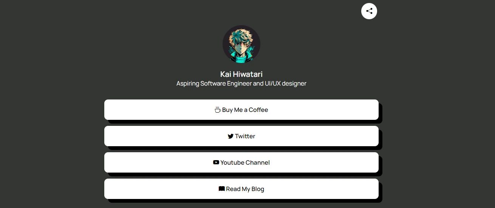

<h1 align='center'><b>💥 LINKTREE CLONE 💥</b></h1>

<!-- -------------------------------------------------------------------------------------------------------------- -->

<h3 align='center'>Tech Stack Used 🎮</h3>

  
  

<!-- -------------------------------------------------------------------------------------------------------------- -->

## :zap: Description 📃

  
A Linktree clone project is a simple web app that allows users to create a personalized page with multiple links to their social media profiles, websites, or other resources, all accessible via a single URL.

<!-- -------------------------------------------------------------------------------------------------------------- -->

## :zap: How to run it? 🕹️

- Clone the repository to your local machine.
- Open the `index.html` file in your web browser to start using the application.

<!-- -------------------------------------------------------------------------------------------------------------- -->

## :zap: Screenshots 📸

<!-- -------------------------------------------------------------------------------------------------------------- -->

<h4 align='center'>Developed By <b><i>Ananya Gupta</i></b> </h4>

  
  

<h4 align='center'>Happy Coding 🧑‍💻</h4>

<h3 align="center">Show some &nbsp;❤️&nbsp; by &nbsp;🌟&nbsp; this repository!</h3>