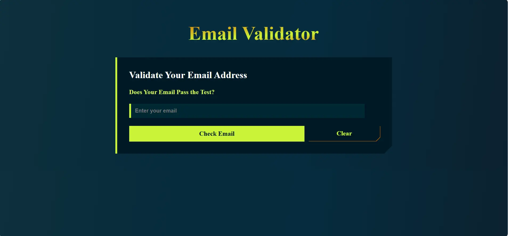

<h1 align='center'><b>Email Validator</b></h1>

<!-- -------------------------------------------------------------------------------------------------------------- -->

<h3 align='center'>Tech Stack Used 🎮</h3>
<!-- enlist all the technologies used to create this project from them (Remove comment using 'ctrl+z' or 'command+z') -->

<div align='center'>
  
  
  
  
</div>


<!-- -------------------------------------------------------------------------------------------------------------- -->

## :zap: Description 📃

- A web-based email validator built with JavaScript, Node.js, HTML, and CSS.  It verifies email format and uses Node.js to perform domain existence checks, including temporary/disposable email detection.

<!-- -------------------------------------------------------------------------------------------------------------- -->

## :zap: How to run it? 🕹️

## Backend Setup (Node.js)

This section describes how to set up the backend server.

1.  **Fork and Clone:** Fork the repository and then clone it to your local machine:

    ```bash
    git clone repository-url
    ```

2.  **Install Dependencies:** Install the required Node.js dependencies:

    ```bash
    npm install
    ```
3.  **Start the node.js Server:** This server validates the email domains.This will start the server and the port will be displayed in the console. This application uses port 3000.

    ```bash
    node server.js
    ```


## Frontend Setup (Html)

  **Navigate to Project Directory:** Right click to open the index.html with a browser of your choice. You are all set to verify your email's validity.

   

<!-- -------------------------------------------------------------------------------------------------------------- -->

## :zap: Screenshot 📸




<!-- -------------------------------------------------------------------------------------------------------------- -->

<h4 align='center'>Developed By <b><i>Nikita Dey</i></b> 👩</h4>
<p align='center'>
  <a href='https://www.linkedin.com/in/nikita-dey-4999ba1b2/'>
    
  </a>
  <a href='https://github.com/DeyNik'>
    
  </a>
</p>

<h4 align='center'>Happy Coding 🧑‍💻</h4>

<h3 align="center">Show some &nbsp;❤️&nbsp; by &nbsp;🌟&nbsp; this repository!</h3>
