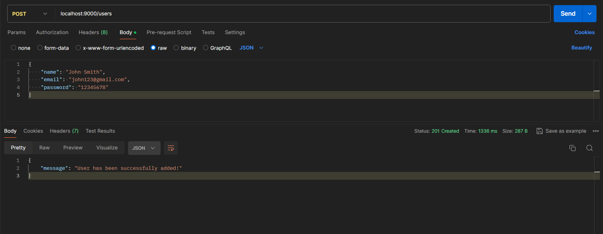
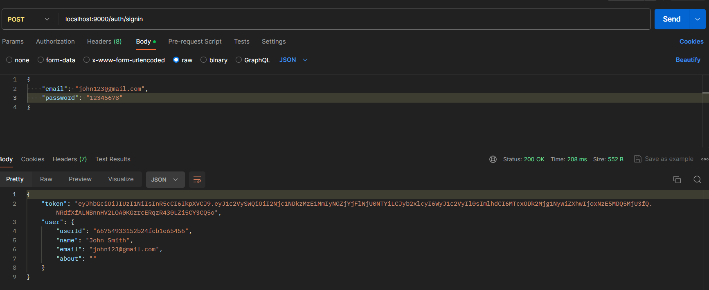
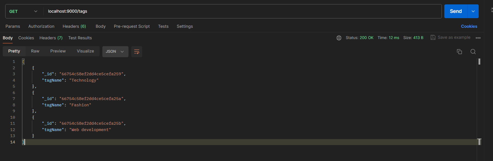
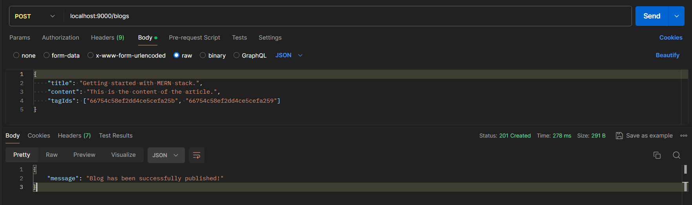
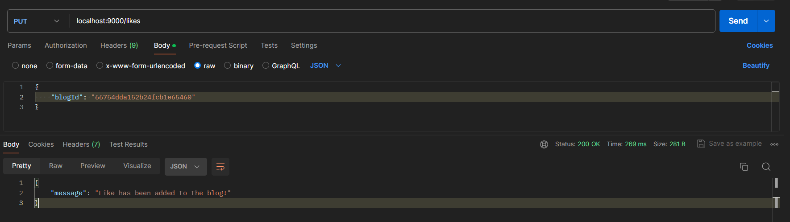
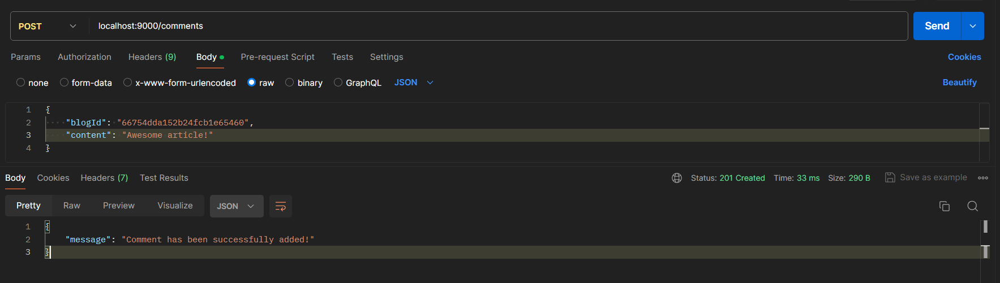
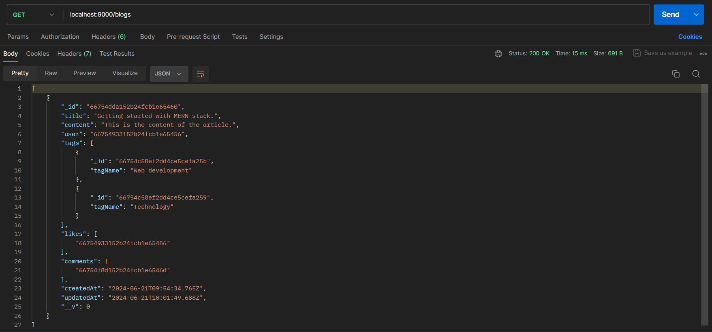

<h1 align='center'><b>💥 BLOG PLATFORM 💥</b></h1>

<!-- -------------------------------------------------------------------------------------------------------------- -->

<h3 align='center'>Tech Stack Used 🎮</h3>
<!-- enlist all the technologies used to create this project from them (Remove comment using 'ctrl+z' or 'command+z') -->

<div align='center'>
  
  
  
</div>


<!-- -------------------------------------------------------------------------------------------------------------- -->

## :zap: Description 📃

- Backend infrastructure for a blogging platform, using Node.js, Express.js, and MongoDB, facilitating seamless management of user and admin roles with role-based authentication.
- Robust user authentication functionalities, including sign-in and sign-up features, ensuring secure access for both users and administrators.
- Users can create, edit, delete and view their own blogs.
- Users can like/unlike, comment, search by tags and view blogs.
- Administrators can manage user, blogs and tags.
  


<!-- -------------------------------------------------------------------------------------------------------------- -->

## :zap: How to run it? 🕹️

1. Fork the repository.

2. Clone the project.

```
git clone repository-url
```

3. Install dependencies.

```
npm install
```

4. Create and update `.env` file.

```
PORT = port-no
MONGODB_URL = your mongodb database url
JWT_SECRET_KEY = your jwt secret key
```

5. Run the server.

```
node app.js
```

6. Check the endpoints via postman/frontend.


<!-- -------------------------------------------------------------------------------------------------------------- -->

## :zap: Screenshots 📸

<br/>
<br/>
<br/>
<br/>
<br/>
<br/>
<br/>


<!-- -------------------------------------------------------------------------------------------------------------- -->

<h4 align='center'>Developed By <b><i>DHARSHI B.</i></b> 👩</h4>
<p align='center'>
  <a href='https://www.linkedin.com/in/dharshi-balasubramaniyam-47b193243'>
    
  </a>
  <a href='https://github.com/DharshiBalasubramaniyam'>
    
  </a>
</p>

<h4 align='center'>Happy Coding 🧑‍💻</h4>

<h3 align="center">Show some &nbsp;❤️&nbsp; by &nbsp;🌟&nbsp; this repository!</h3>
