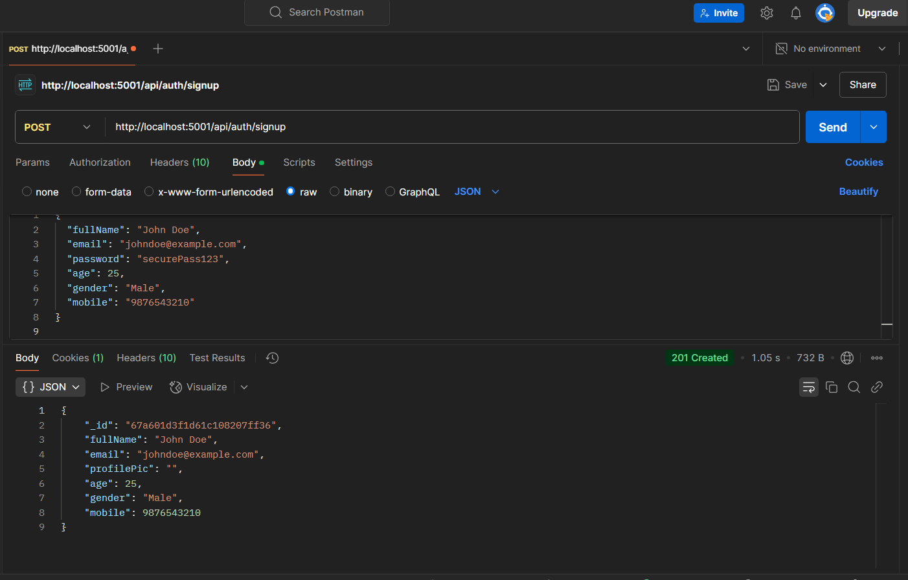
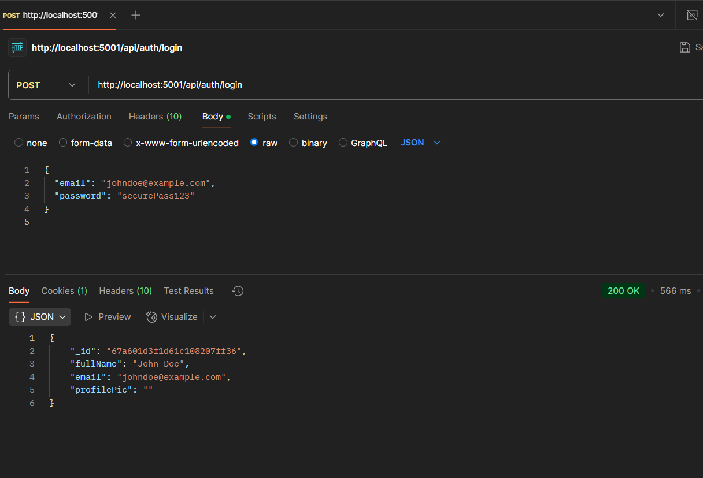
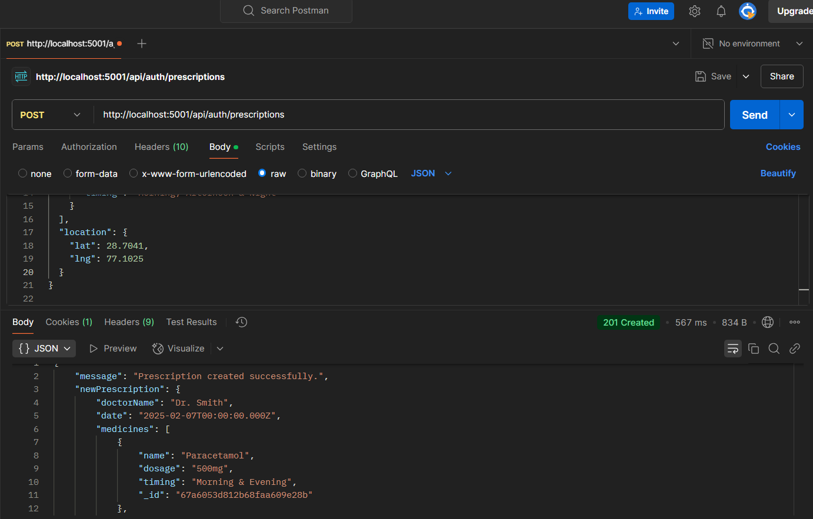

<h1 align='center'><b>💥 MedBrain - Patient Prescription Management 💥</b></h1>

<!-- -------------------------------------------------------------------------------------------------------------- -->

<h3 align='center'>Tech Stack Used 🎮</h3>
<!-- enlist all the technologies used to create this project from them (Remove comment using 'ctrl+z' or 'command+z') -->

  
  
  
  

<!-- -------------------------------------------------------------------------------------------------------------- -->

## :zap: Description 📃

MedBrain is a backend infrastructure for a prescription management system where patient prescriptions are stored, managed, and can be updated by doctors. It allows **doctors** to create, update, and delete prescriptions, while **patients** can access their prescription details.

<!-- -------------------------------------------------------------------------------------------------------------- -->

## :zap: How to run it? 🕹️

1. Fork the repository.

2. Clone the project.

git clone repository-url

3. Install dependencies.

npm install

4. Create and update `.env` file.

MONGODB_URI = YOUR_MONGODB_URI
PORT = 5001
JWT_SECRET =YOUR_SECRET
NODE_ENV = development
CLOUDINARY_CLOUD_NAME = Your clodinary name
CLOUDINARY_API_KEY = your api key
CLOUDINARY_API_SECRET = your secret
API_KEY = your key

5. Run the server.

npm start
## :zap: Screenshots 📸

### REGISTER (Authentication: No)

### LOGIN (Authentication: No)

### CREATE PRESCRIPTION (Authentication: Doctor/Admin)

---

<!-- -------------------------------------------------------------------------------------------------------------- -->

<h4 align='center'>Developed By <b><i>Your Name</i></b> 👩</h4>

  
  

<h4 align='center'>Happy Coding 🧑‍💻</h4>

<h3 align="center">Show some &nbsp;❤️&nbsp; by &nbsp;🌟&nbsp; this repository!</h3>