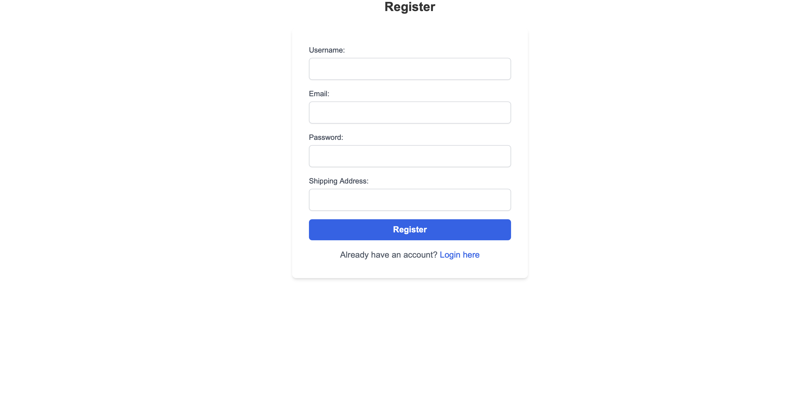
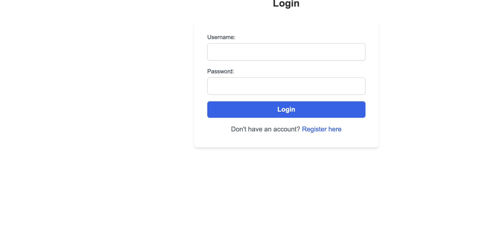
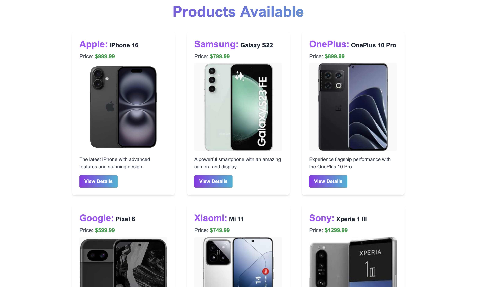
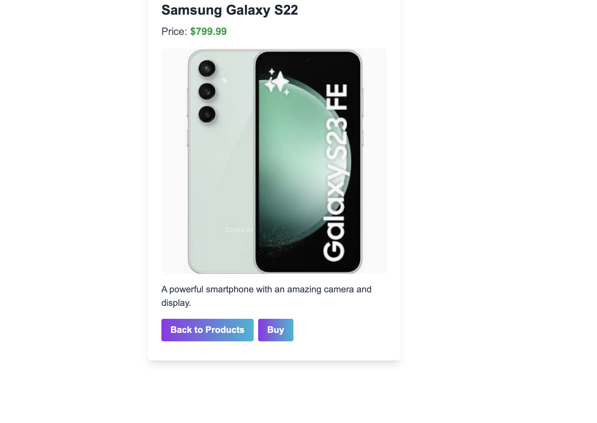

<h1 align='center'><b>💥 Moibile Shopping Website 💥</b></h1>

<!-- -------------------------------------------------------------------------------------------------------------- -->

<h3 align='center'>Tech Stack Used 🎮</h3>
<!-- enlist all the technologies used to create this project from them (Remove comment using 'ctrl+z' or 'command+z') -->


<div align='center'>
  
  
  
  
</div>


<!-- -------------------------------------------------------------------------------------------------------------- -->
## :zap: Description 📃

This project is a **Mobile Shopping Website** designed to provide users with an intuitive platform for browsing a wide range of mobile devices from various global brands.

### Key Features:

- **Product Browsing**:
  - Users can easily browse through a diverse selection of mobile brands and models.
  - A user-friendly interface allows for seamless navigation between different product categories.

- **Product Details**:
  - Users can view detailed information for each mobile device, including specifications, images, and pricing.
  - Each product page provides essential details to help users make informed purchasing decisions.

### Tech Stack Used:
- **Backend**: Node.js and Express.js for server-side logic and API development.
- **Frontend**: Angular for building a dynamic and responsive user interface.
- **Database**: MongoDB for storing product information and user data.
- **Other Technologies**: HTML, CSS, and additional libraries as needed for styling and functionality.

### Category:
- Node.js

This mobile shopping website aims to enhance the user experience by making it easy to discover and explore mobile devices, ensuring that users have all the information they need at their fingertips.


<!-- -------------------------------------------------------------------------------------------------------------- -->

## :zap: How to run it? 🕹️

1. Fork the repository.

2. Clone the project.

```
git clone repository-url
```

3. Install dependencies.

```
npm install
```

4. Create and update `.env` file.

```
PORT = port-no
MONGODB_URL = your mongodb database url
JWT_SECRET_KEY = your jwt secret key
```

5. Run the server.

```
node server.js
```

6. Check the endpoints via postman/frontend.


7.Run the Frontend
```
ng serve
```


<!-- -------------------------------------------------------------------------------------------------------------- -->

## :zap: Screenshots 📸

<br/>
<br/>
<br/>
<br/>


<!-- -------------------------------------------------------------------------------------------------------------- -->

<h4 align='center'>Developed By <b><i>Pradyuman Shrarma</i></b> </h4>


<h4 align='center'>Happy Coding 🧑‍💻</h4>

