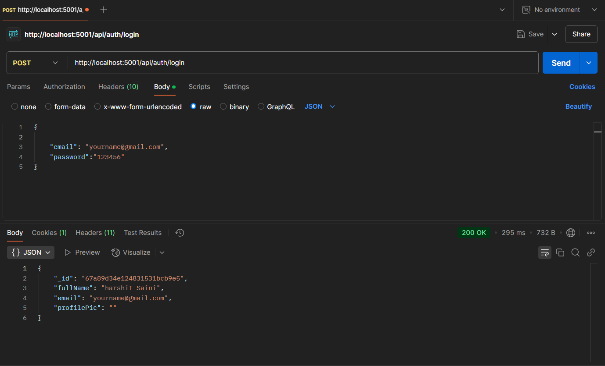

<h1 align='center'><b>💬 Real-Time Chat App 💬</b></h1>

<!-- -------------------------------------------------------------------------------------------------------------- -->

<h3 align='center'>Tech Stack Used 🎮</h3>
<!-- enlist all the technologies used to create this project from them (Remove comment using 'ctrl+z' or 'command+z') -->

  
  
  
  
  

<!-- -------------------------------------------------------------------------------------------------------------- -->

## :zap: Description 📃

Real-Time Chat App is a backend infrastructure that allows users to chat with each other in real-time. The app supports authentication and maintains active sessions for logged-in users. **Users** can send and receive messages instantly. It leverages **Socket.io** for real-time communication and **JWT** for secure user authentication.

<!-- -------------------------------------------------------------------------------------------------------------- -->

## :zap: How to run it? 🕹️

1. Fork the repository.

2. Clone the project.

git clone repository-url

3. Install dependencies.

npm install

4. Create and update `.env` file.

MONGODB_URI = YOUR_MONGODB_URI  
PORT = 5001  
JWT_SECRET = YOUR_SECRET  
NODE_ENV = development  

5. Run the server.

npm start

6. In another terminal, start the client-side of the application (if applicable).

cd client  
npm start

## :zap: Screenshots 📸

### LOGIN (Authentication: Yes)

### CHATROOM (Real-Time Messaging)

---

<!-- -------------------------------------------------------------------------------------------------------------- -->

<h4 align='center'>Developed By <b><i>Harshit</i></b> 👩</h4>

  
  

<h4 align='center'>Happy Coding 🧑‍💻</h4>

<h3 align="center">Show some &nbsp;❤️&nbsp; by &nbsp;🌟&nbsp; this repository!</h3>
