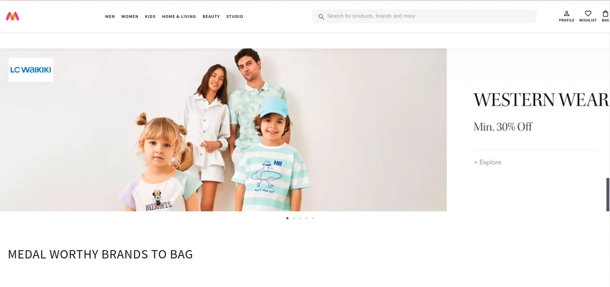

<h1 align='center'><b>💥 MYNTRA-CLONE 💥</b></h1>

<!-- -------------------------------------------------------------------------------------------------------------- -->

<h3 align='center'>Tech Stack Used 🎮</h3>
<!-- enlist all the technologies used to create this project from them (Remove comment using 'ctrl+z' or 'command+z') -->

  
  
  
  
  

<!-- -------------------------------------------------------------------------------------------------------------- -->

## :zap: Description 📃

  
This project is a clone of the Myntra website, created using React and Material-UI. It features a responsive navbar, product listings, and user authentication functionalities.

<!-- -------------------------------------------------------------------------------------------------------------- -->

## :zap: How to run it? 🕹️

<!-- Add steps how to run this project -->

1. Clone the repository
2. Go to the folder of the myntra clone in React-JS-Projects --> Intermediate -- > myntra-clone.
3. then pnpm  i in the terminal 
4. lastly pnpm start the project.
<!-- -------------------------------------------------------------------------------------------------------------- -->

## :zap: Screenshots 📸
<!-- add the screenshot of the project (Mandatory) -->

## :zap: Working Video 📹
<!-- directly add the link of video (If, possible) -->

[Watch the video](https://www.loom.com/share/ba686409f6da49e3b50153145fae373f?sid=9ab9667d-db35-4b31-afb8-11c0006bf10d)

<!-- -------------------------------------------------------------------------------------------------------------- -->

<h4 align='center'>Developed By <b><i>Sanaya Mahajan</i></b> 👦</h4>

  
  

<h4 align='center'>Happy Coding 🧑‍💻</h4>

<h3 align="center">Show some &nbsp;❤️&nbsp; by &nbsp;🌟&nbsp; this repository!</h3>